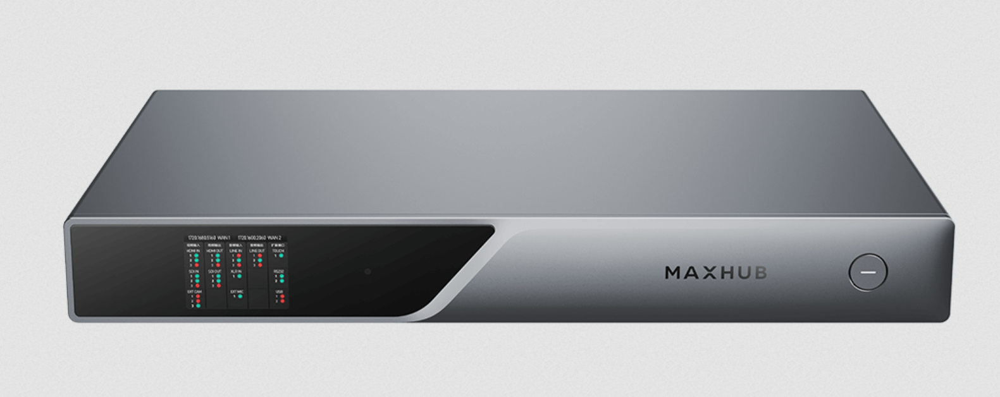
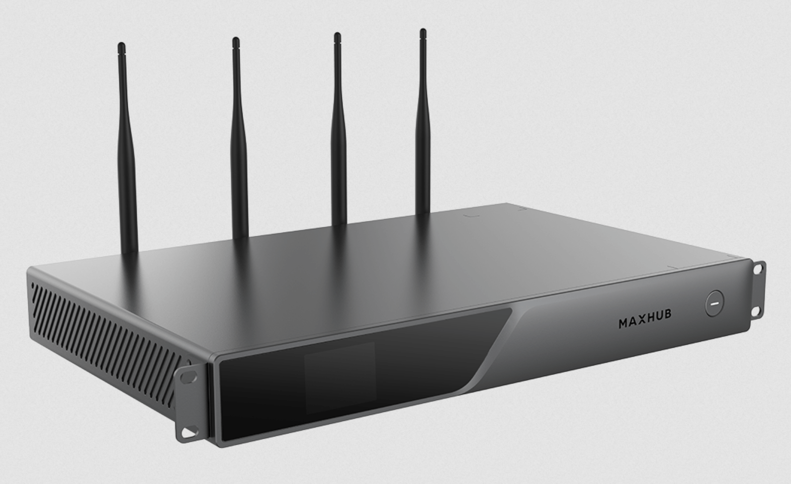
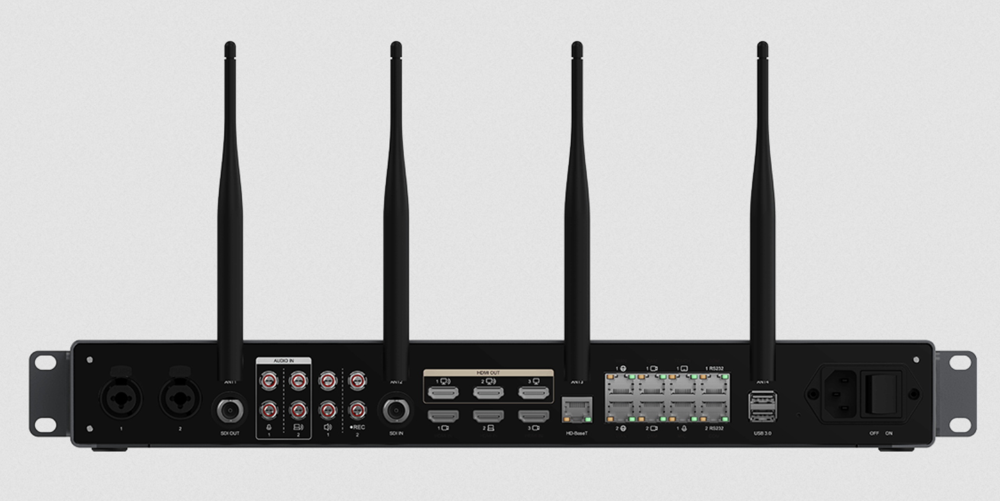
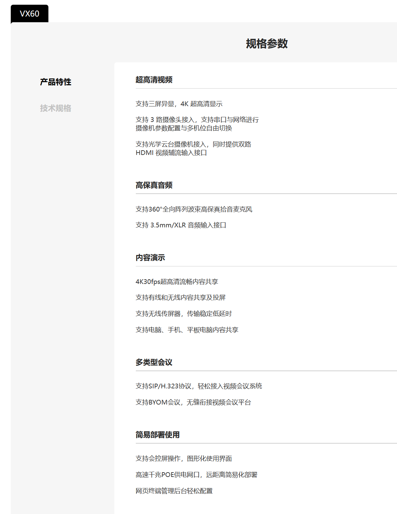
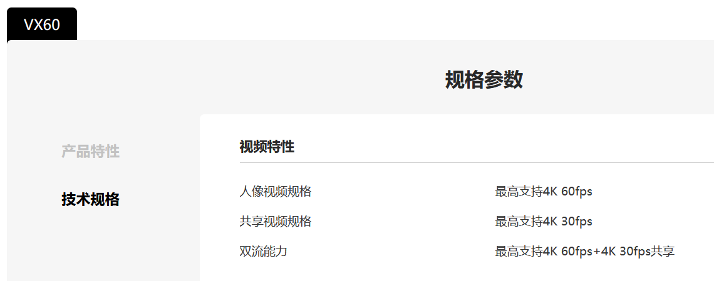
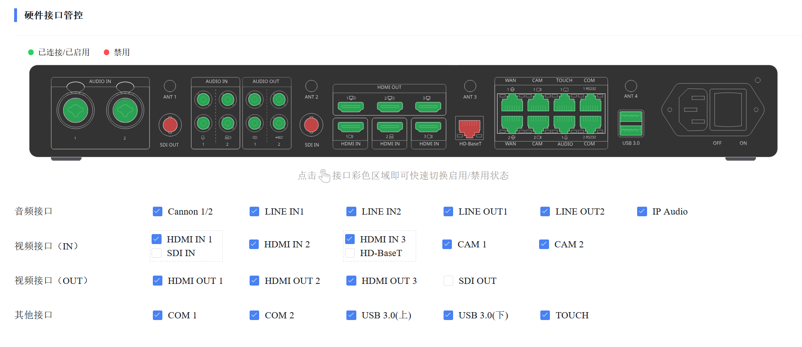
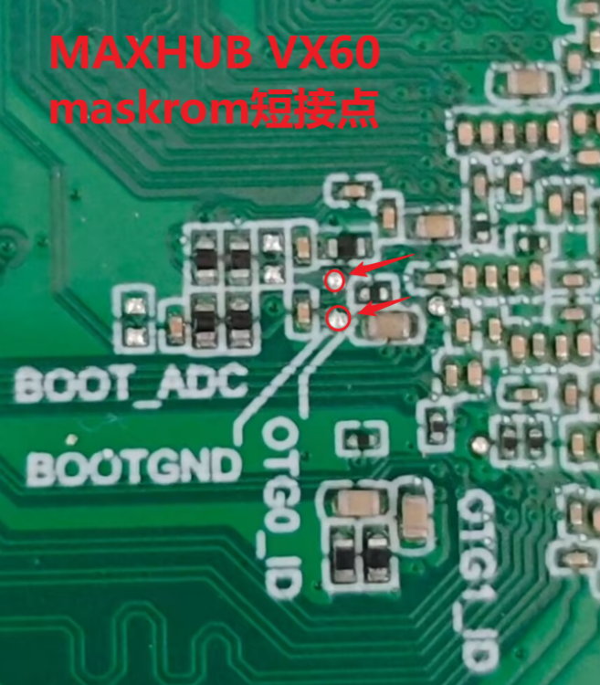
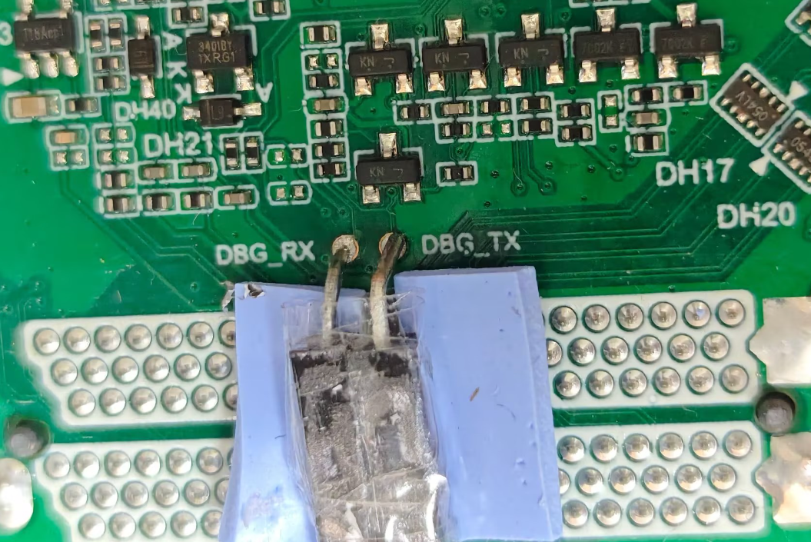

# MAXHUB VX60

## 目录

* [硬件规格](docs/硬件规格.md)
* [官方答疑](docs/官方答疑.md)
* [固件](docs/固件.md)
  * [原厂工程固件](docs/固件/原厂工程固件.md)
  * [工行固件](docs/固件/工行固件.md)
  * [OpenWrt LEDE系统](docs/固件/openwrt.md)
  
---

## 简介

MAXHUB VX60 是一款**分体式视频会议终端**，专为中大型会议室和专业视频会议场景设计。以下是其核心功能与技术特点的详细介绍：

一、核心性能

- **国产处理芯片与嵌入式操作系统**：采用国产化硬件平台，保障信息安全与自主可控。
- **强大的视频编解码能力**：
    - 最高支持 **4K@60fps + 4K@30fps** 双路视频输入/输出。
    - 支持 **4K三屏异显**，可同时显示本地画面、远端画面和辅流（如共享文档）。

二、视频与摄像系统

- **支持3路摄像头接入**：灵活适配多机位部署，适用于大型会场。
- **摄像机控制**：
    - 支持通过**串口或网络**对摄像头参数进行配置。
    - 支持**多机位自由切换**，提升会议视觉体验。
- **后处理视频超分技术**：智能提升低分辨率视频源的画质，使画面更清晰。

三、音频处理能力

- **原声模式**：有效分离人声与背景噪音，还原清晰、自然的会场人声。
- 适用于嘈杂环境，确保远程参会者听得清楚、听得真实。

四、应用场景

- 适用于政府、金融、教育、企业等对**安全性、稳定性、画质要求较高**的视频会议场景。
- 可与 MAXHUB 的其他会议设备（如 SC800 摄像头、BM50 全向麦等）组成完整音视频解决方案。

五、产品定位

- 属于 MAXHUB **专业级分体式会议终端系列**（VX 系列），相比一体机更灵活、扩展性更强。
- 适合已有显示设备或需定制化部署的客户。

## 参数规格

## 资料

联系官方客服获取资料

- vx60工行调试升级文档、固件及操作指南（包含AFXXMC、VX41、MS51）：<https://cvte.kdocs.cn/l/cgOFrffWyLnY>
- VX60固件：<https://drive.cvte.com/p/DWod18YQqZcCGPWINiAA>
- 工行固件打包：<https://drive.cvte.com/p/DYaCLWYQsD8Y6_sOIAA>

## maskrom短接点和ttl

- maskrom短接点：

需要拆机，在背面。已测试，此位置100%可行。

- debug调试口
  
需要拆机，在背面。DBG_RX/DBG_TX 丝印位置，GND主板任意位置选择即可。

## 免责申明

- 本仓库所提供的内容均基于公开、合法渠道整理，仅供用户参考与学习之用。
- 严格遵守国家相关法律法规，尊重并保护个人隐私及知识产权。
- 如您认为相关内容涉及您的隐私、版权或其他合法权益，请及时联系，将依法核实并在必要时予以删除或下架。
- 对于因使用或无法使用本网站/平台内容所引发的任何直接或间接损失，不承担任何法律责任。
- 用户在使用过程中应自行判断信息的适用性，并承担相应风险。

---

