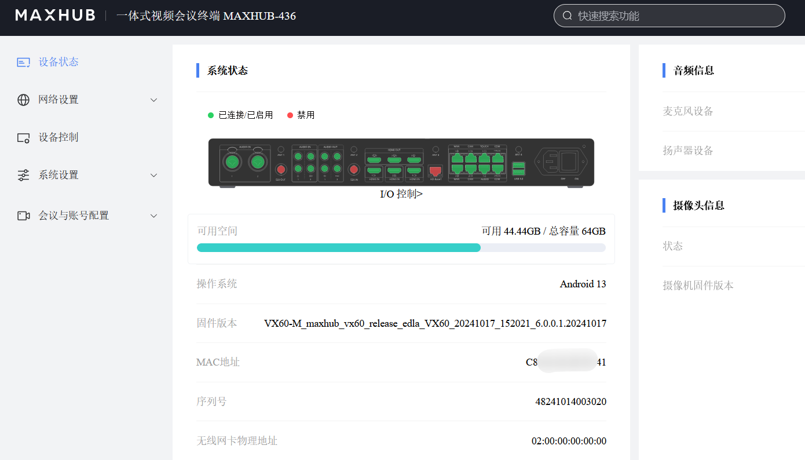
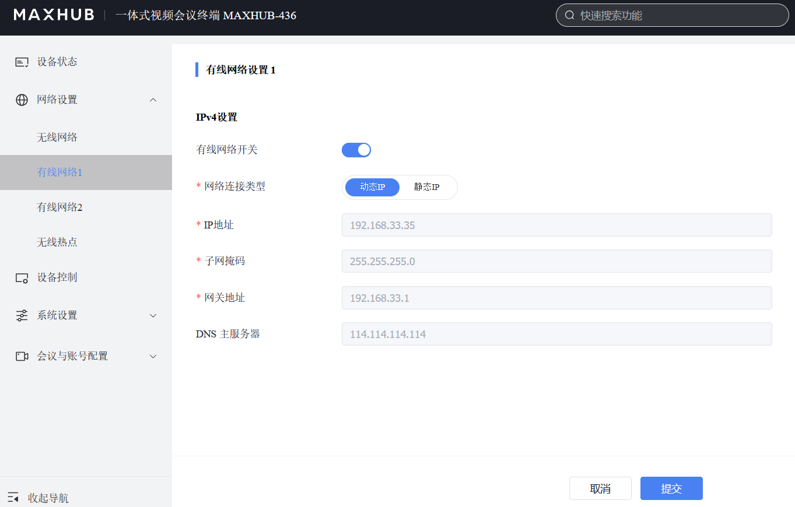
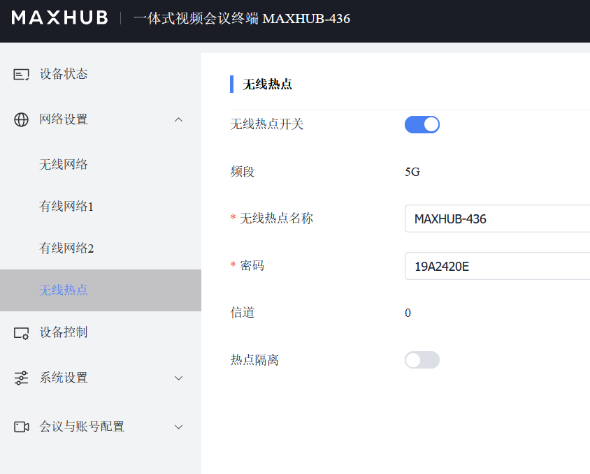
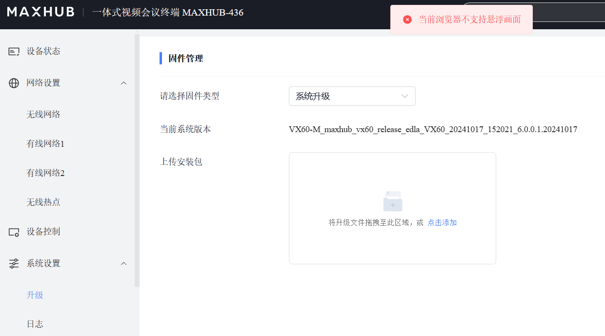
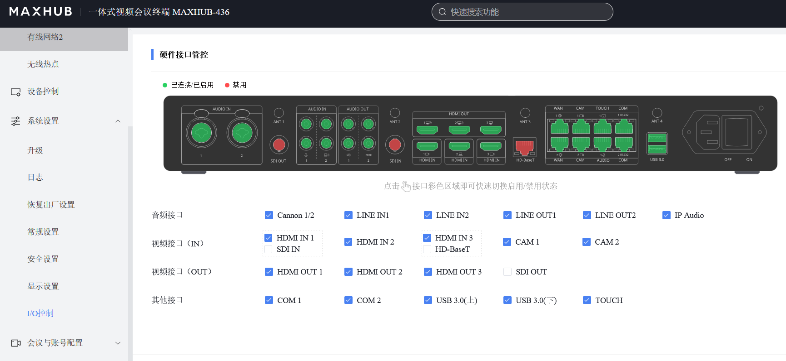
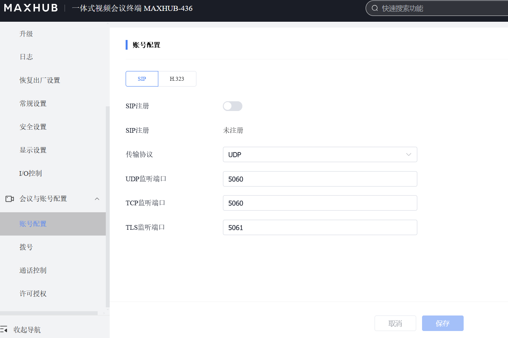
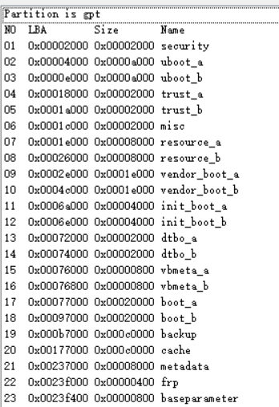
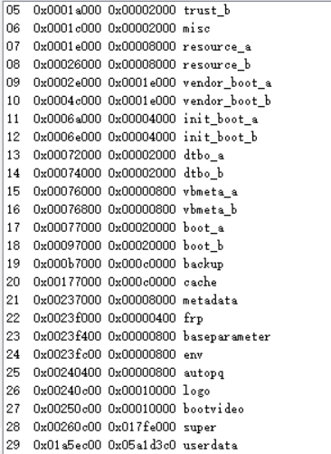
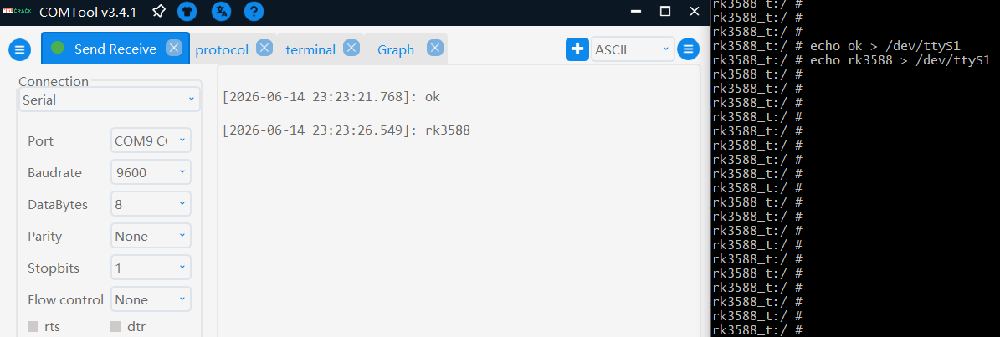
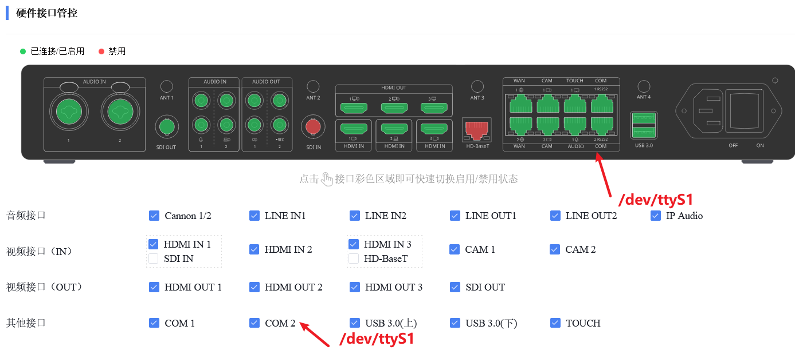

# VX60-M_maxhub_vx60_release_edla_VX60_20241017_152021_6.0.0.1.20241017

## web页面














## 分区情况






| NO  | LBA (Hex)       | Size (Hex)      | Name          |
|-----|-----------------|-----------------|---------------|
| 01  | 0x00002000      | 0x00002000      | security      |
| 02  | 0x00004000      | 0x0000a000      | uboot_a       |
| 03  | 0x0000e000      | 0x0000a000      | uboot_b       |
| 04  | 0x00018000      | 0x00002000      | trust_a       |
| 05  | 0x0001a000      | 0x00002000      | trust_b       |
| 06  | 0x0001c000      | 0x00002000      | misc          |
| 07  | 0x0001e000      | 0x00008000      | resource_a    |
| 08  | 0x00026000      | 0x00008000      | resource_b    |
| 09  | 0x0002e000      | 0x0001e000      | vendor_boot_a |
| 10  | 0x0004c000      | 0x0001e000      | vendor_boot_b |
| 11  | 0x0006a000      | 0x00004000      | init_boot_a   |
| 12  | 0x0006e000      | 0x00004000      | init_boot_b   |
| 13  | 0x00072000      | 0x00002000      | dtbo_a        |
| 14  | 0x00074000      | 0x00002000      | dtbo_b        |
| 15  | 0x00076000      | 0x00000800      | vbmeta_a      |
| 16  | 0x00076800      | 0x00000800      | vbmeta_b      |
| 17  | 0x00077000      | 0x00020000      | boot_a        |
| 18  | 0x00097000      | 0x00020000      | boot_b        |
| 19  | 0x000b7000      | 0x000c0000      | backup        |
| 20  | 0x00177000      | 0x000c0000      | cache         |
| 21  | 0x00237000      | 0x00008000      | metadata      |
| 22  | 0x0023f000      | 0x00000400      | frp           |
| 23  | 0x0023f400      | 0x00000800      | baseparameter |
| 24  | 0x0023fc00      | 0x00000800      | env           |
| 25  | 0x00240400      | 0x00000800      | autopq        |
| 26  | 0x00240c00      | 0x00001000      | logo          |
| 27  | 0x00250c00      | 0x00001000      | bootvideo     |
| 28  | 0x00260c00      | 0x0017fe00      | super       |
| 29  | 0x01a5ec00      | 0x05a1d3c0      | userdata      |

✅ **说明**：
- LBA 和 Size 均为十六进制表示（符合 GPT 分区表惯例）。
- `super` 和 `userdata` 是 Android A/B 设备中常见的动态分区与用户数据分区。


## 系统root


```shell
$ fastboot getvar unlocked
unlocked: no
Finished. Total time: 0.018s
```


fastboot --disable-verity --disable-verification flash vbmeta vbmeta.img

fastboot --disable-verity --disable-verification flash init_boot_a initboot.img

```shell

a94ba521378b675b741aa478e58989dc *init_boot_a.img
a94ba521378b675b741aa478e58989dc *init_boot_b.img
576715cf6f51100271a0c4b50f53a3dc *vbmeta_a.img
576715cf6f51100271a0c4b50f53a3dc *vbmeta_b.img

```

root步骤

1. 刷vbmeta-hack

fastboot flash vbmeta_a vbmeta-hack.img
fastboot flash vbmeta_b vbmeta-hack.img

其中vbmeta-hack生成步骤

```shell
./avbtool make_vbmeta_image   --include_descriptors_from_image vbmeta.img-origin   --set_hashtree_disabled_flag   --output vbmeta-hack.img   
```
建议基于原始vbmeta.img-origin生成vbmeta-hack.img

2. 刷init_boot补丁

fastboot --disable-verity --disable-verification flash init_boot_a magisk_patched-30700_DtzZR.img
fastboot --disable-verity --disable-verification flash init_boot_b magisk_patched-30700_DtzZR.img


## vbmeta原版

```shell

[root@hailun ~/vbmeta]# ./avbtool info_image --image vbmeta.img-origin 
Minimum libavb version:   1.0
Header Block:             256 bytes
Authentication Block:     576 bytes
Auxiliary Block:          11456 bytes
Public key (sha1):        8adad1c1270df79cd3a7de181a921bcab313df20
Algorithm:                SHA256_RSA4096
Rollback Index:           1709596800
Flags:                    0
Rollback Index Location:  0
Release String:           'avbtool 1.2.0'
Descriptors:
    Chain Partition descriptor:
      Partition Name:          boot
      Rollback Index Location: 2
      Public key (sha1):       8adad1c1270df79cd3a7de181a921bcab313df20
      Flags:                   0
    Chain Partition descriptor:
      Partition Name:          init_boot
      Rollback Index Location: 3
      Public key (sha1):       8adad1c1270df79cd3a7de181a921bcab313df20
      Flags:                   0
    Prop: com.android.build.vendor_boot.fingerprint -> 'MAXHUB/VX60/rk3588_t:13/TD1A.220804.031/20250526.223342:user/release-keys'
    Prop: com.android.build.system.os_version -> '13'
    Prop: com.android.build.system.fingerprint -> 'MAXHUB/VX60/rk3588_t:13/TD1A.220804.031/20250526.223342:user/release-keys'
    Prop: com.android.build.system.security_patch -> '2024-03-05'
    Prop: com.android.build.vendor.os_version -> '13'
    Prop: com.android.build.vendor.fingerprint -> 'MAXHUB/VX60/rk3588_t:13/TD1A.220804.031/20250526.223342:user/release-keys'
    Prop: com.android.build.vendor.security_patch -> '2024-03-05'
    Prop: com.android.build.product.os_version -> '13'
    Prop: com.android.build.product.fingerprint -> 'MAXHUB/VX60/rk3588_t:13/TD1A.220804.031/20250526.223342:user/release-keys'
    Prop: com.android.build.product.security_patch -> '2024-03-05'
    Prop: com.android.build.system_ext.os_version -> '13'
    Prop: com.android.build.system_ext.fingerprint -> 'MAXHUB/VX60/rk3588_t:13/TD1A.220804.031/20250526.223342:user/release-keys'
    Prop: com.android.build.system_ext.security_patch -> '2024-03-05'
    Prop: com.android.build.odm.os_version -> '13'
    Prop: com.android.build.odm.fingerprint -> 'MAXHUB/VX60/rk3588_t:13/TD1A.220804.031/20250526.223342:user/release-keys'
    Prop: com.android.build.vendor_dlkm.os_version -> '13'
    Prop: com.android.build.vendor_dlkm.fingerprint -> 'MAXHUB/VX60/rk3588_t:13/TD1A.220804.031/20250526.223342:user/release-keys'
    Prop: com.android.build.odm_dlkm.os_version -> '13'
    Prop: com.android.build.odm_dlkm.fingerprint -> 'MAXHUB/VX60/rk3588_t:13/TD1A.220804.031/20250526.223342:user/release-keys'
    Prop: com.android.build.system_dlkm.os_version -> '13'
    Prop: com.android.build.system_dlkm.fingerprint -> 'MAXHUB/VX60/rk3588_t:13/TD1A.220804.031/20250526.223342:user/release-keys'
    Prop: com.android.build.dtbo.fingerprint -> 'MAXHUB/VX60/rk3588_t:13/TD1A.220804.031/20250526.223342:user/release-keys'
    Hash descriptor:
      Image Size:            1209 bytes
      Hash Algorithm:        sha256
      Partition Name:        dtbo
      Salt:                  f391d68fbeb7f2f1d963d4d03f9ab895e3e0530b4bc35e9e8167319236d0a0c5
      Digest:                d2511201a19c8fa2df62e44369d92aa301b47cb284606152159d2e469a1caca3
      Flags:                 0
    Hash descriptor:
      Image Size:            50382848 bytes
      Hash Algorithm:        sha256
      Partition Name:        vendor_boot
      Salt:                  be089704bc6615a017fb98d44251129a16b6a870b6951931826645e1a6eb44de
      Digest:                767c9436cc4c3540b13eec6324a538ec21d52a009d667874a553ac2c7142815c
      Flags:                 0
    Hashtree descriptor:
      Version of dm-verity:  1
      Image Size:            282624 bytes
      Tree Offset:           282624
      Tree Size:             4096 bytes
      Data Block Size:       4096 bytes
      Hash Block Size:       4096 bytes
      FEC num roots:         2
      FEC offset:            286720
      FEC size:              8192 bytes
      Hash Algorithm:        sha256
      Partition Name:        odm
      Salt:                  a9ff1e4ad33f3db0c4c9f6a3af9474f8736107ac35ac8df9cbe64abebf91c517
      Root Digest:           9b931de60eac1aed24f78c5340fb7b128d9b741a818f5bb057eb0b35c738f487
      Flags:                 0
    Hashtree descriptor:
      Version of dm-verity:  1
      Image Size:            8192 bytes
      Tree Offset:           8192
      Tree Size:             4096 bytes
      Data Block Size:       4096 bytes
      Hash Block Size:       4096 bytes
      FEC num roots:         2
      FEC offset:            12288
      FEC size:              8192 bytes
      Hash Algorithm:        sha256
      Partition Name:        odm_dlkm
      Salt:                  a9ff1e4ad33f3db0c4c9f6a3af9474f8736107ac35ac8df9cbe64abebf91c517
      Root Digest:           5201228b0964cbb05ddd8a71081250ff1ccea4174bd71164be5d3d643987e99d
      Flags:                 0
    Hashtree descriptor:
      Version of dm-verity:  1
      Image Size:            126361600 bytes
      Tree Offset:           126361600
      Tree Size:             1003520 bytes
      Data Block Size:       4096 bytes
      Hash Block Size:       4096 bytes
      FEC num roots:         2
      FEC offset:            127365120
      FEC size:              1007616 bytes
      Hash Algorithm:        sha256
      Partition Name:        product
      Salt:                  a9ff1e4ad33f3db0c4c9f6a3af9474f8736107ac35ac8df9cbe64abebf91c517
      Root Digest:           a36fae5613aac3ffcaf9315bc7d31db2adfff6320dfb612cb1d4d3f89ff8a0ba
      Flags:                 0
    Hashtree descriptor:
      Version of dm-verity:  1
      Image Size:            974848000 bytes
      Tree Offset:           974848000
      Tree Size:             7684096 bytes
      Data Block Size:       4096 bytes
      Hash Block Size:       4096 bytes
      FEC num roots:         2
      FEC offset:            982532096
      FEC size:              7774208 bytes
      Hash Algorithm:        sha256
      Partition Name:        system
      Salt:                  a9ff1e4ad33f3db0c4c9f6a3af9474f8736107ac35ac8df9cbe64abebf91c517
      Root Digest:           44a4e9e398646439331822af285e5844f26342c0a399223f8fe945881fb65957
      Flags:                 0
    Hashtree descriptor:
      Version of dm-verity:  1
      Image Size:            8192 bytes
      Tree Offset:           8192
      Tree Size:             4096 bytes
      Data Block Size:       4096 bytes
      Hash Block Size:       4096 bytes
      FEC num roots:         2
      FEC offset:            12288
      FEC size:              8192 bytes
      Hash Algorithm:        sha256
      Partition Name:        system_dlkm
      Salt:                  a9ff1e4ad33f3db0c4c9f6a3af9474f8736107ac35ac8df9cbe64abebf91c517
      Root Digest:           5aa2d411d6f1edc4c231b50bf007e6d574611f9a034f6fd993de883ef768af82
      Flags:                 0
    Hashtree descriptor:
      Version of dm-verity:  1
      Image Size:            550199296 bytes
      Tree Offset:           550199296
      Tree Size:             4341760 bytes
      Data Block Size:       4096 bytes
      Hash Block Size:       4096 bytes
      FEC num roots:         2
      FEC offset:            554541056
      FEC size:              4390912 bytes
      Hash Algorithm:        sha256
      Partition Name:        system_ext
      Salt:                  a9ff1e4ad33f3db0c4c9f6a3af9474f8736107ac35ac8df9cbe64abebf91c517
      Root Digest:           c2312d060324caa4cf3618432c0340ee1d3a17b7927b4cb3421c3b2534700c76
      Flags:                 0
    Hashtree descriptor:
      Version of dm-verity:  1
      Image Size:            610136064 bytes
      Tree Offset:           610136064
      Tree Size:             4812800 bytes
      Data Block Size:       4096 bytes
      Hash Block Size:       4096 bytes
      FEC num roots:         2
      FEC offset:            614948864
      FEC size:              4866048 bytes
      Hash Algorithm:        sha256
      Partition Name:        vendor
      Salt:                  a9ff1e4ad33f3db0c4c9f6a3af9474f8736107ac35ac8df9cbe64abebf91c517
      Root Digest:           1969a0d6540188f3c8f64f07a27f6e001bf0efd9ff328ea6dae200d5c6175c52
      Flags:                 0
    Hashtree descriptor:
      Version of dm-verity:  1
      Image Size:            189820928 bytes
      Tree Offset:           189820928
      Tree Size:             1503232 bytes
      Data Block Size:       4096 bytes
      Hash Block Size:       4096 bytes
      FEC num roots:         2
      FEC offset:            191324160
      FEC size:              1515520 bytes
      Hash Algorithm:        sha256
      Partition Name:        vendor_dlkm
      Salt:                  a9ff1e4ad33f3db0c4c9f6a3af9474f8736107ac35ac8df9cbe64abebf91c517
      Root Digest:           757b3bdc2d18271cab113b1884d8c40171b387de8fdf2e131aa15215cef37e2f
      Flags:                 0

```


## 串口数据

```shell
[2026-06-14 22:25:52.381] [HEX]: 1B A1 E1 02 26 F9 70 F6 0D 00 00 00 02 00 00 00 1B B0 00 00 
[2026-06-14 22:26:04.403] [HEX]: 1B A1 E1 02 F6 0F A3 01 0D 00 00 00 02 00 00 00 1B B0 00 00 
[2026-06-14 22:26:16.424] [HEX]: 1B A1 E1 02 A3 36 D5 0C 0D 00 00 00 02 00 00 00 1B B0 00 00 
[2026-06-14 22:26:28.446] [HEX]: 1B A1 E1 02 D7 4E 07 18 0D 00 00 00 02 00 00 00 1B B0 00 00 
[2026-06-14 22:26:40.468] [HEX]: 1B A1 E1 02 7F 76 39 23 0D 00 00 00 02 00 00 00 1B B0 00 00 
[2026-06-14 22:26:52.490] [HEX]: 1B A1 E1 02 85 8E 6B 2E 0D 00 00 00 02 00 00 00 1B B0 00 00 
[2026-06-14 22:27:04.511] [HEX]: 1B A1 E1 02 04 B6 9D 39 0D 00 00 00 02 00 00 00 1B B0 00 00 
[2026-06-14 22:27:09.514] [HEX]: 00 00 00 00 1B A1 A3 05 C9 09 00 00 02 00 00 00 04 00 00 00 1B B0 00 00 1B A1 B3 05 49 1C 00 00 00 00 00 00 1B B0 00 00 1B A1 23 0A C6 BC 04 00 01 96 69 69 16 1B B0 00 1B A1 93 03 FA BC 04 00 00 00 00 00 00 00 00 00 1B B0 00 00 1B A1 93 03 2E BD 04 00 0F 00 00 00 E4 EF 07 00 1B B0 00 00 1B A1 53 01 2B DA 04 00 02 00 00 00 00 00 00 00 00 00 00 00 1B B0 00 00 1B A1 C3 05 40 ED 04 00 15 00 00 00 1B B0 00 00 1B A1 53 01 7D ED 04 00 02 00 00 00 00 00 00 00 04 00 00 00 1B B0 00 00 1B A1 53 01 98 EE 04 00 02 00 00 00 00 00 00 00 05 00 00 00 1B B0 00 00 1B A1 53 01 B8 EF 04 00 02 00 00 00 00 00 00 00 06 00 00 00 1B B0 00 00 1B A1 53 01 D9 F0 04 00 02 00 00 00 00 00 00 00 07 00 00 00 1B B0 00 00 1B A1 53 01 B3 F2 04 00 02 00 00 00 00 00 00 00 08 00 00 00 1B B0 00 00 1B A1 53 01 99 F4 04 00 02 00 00 00 00 00 00 00 0D 00 00 00 1B B0 00 00 1B A1 A3 0A 1A 0F 05 00 00 00 00 00 FB 62 42 EA 04 04 1B B0 1B A1 A3 0A 90 16 05 00 00 00 00 00 FB 62 42 EA 04 04 1B B0 1B A1 A3 0A CC 16 05 00 00 00 00 00 FB 62 42 EA 04 04 1B B0 1B A1 43 09 61 1E 05 00 07 05 15 00 02 07 E7 07 16 27 00 00 01 00 00 1B B0 00 00 00 1B A1 B3 05 A2 1E 05 00 01 00 00 00 1B B0 00 00 1B A1 53 05 5F 41 05 00 04 00 00 00 00 00 00 00 1B B0 00 00 1B A1 C3 05 D3 46 05 00 16 00 00 00 1B B0 00 00 1B A1 13 02 18 47 05 00 00 00 00 00 00 00 00 00 1B B0 00 00 1B A1 33 02 6A 49 05 00 03 00 00 00 00 00 00 00 1B B0 00 00 1B A1 43 02 BB 4B 05 00 03 00 00 00 00 00 00 00 1B B0 00 00 1B A1 53 0C 3D 53 05 00 00 1B B0 00 1B A1 53 05 25 F2 05 00 04 00 00 00 01 00 00 00 1B B0 00 00 1B A1 53 05 F8 F3 05 00 04 00 00 00 02 00 00 00 1B B0 00 00 1B A1 A3 0A 3D F5 05 00 00 00 00 00 FB 62 42 EA 04 04 1B B0 1B A1 53 05 91 FF 05 00 03 00 00 00 00 00 00 00 1B B0 00 00 1B A1 73 04 47 00 06 00 20 00 00 00 00 00 00 00 00 00 00 00 00 00 00 00 1B B0 00 00 1B A1 C3 05 0C 02 06 00 17 00 00 00 1B B0 00 00 1B A1 53 05 4F 06 06 00 03 00 00 00 01 00 00 00 1B B0 00 00 1B A1 53 05 86 07 06 00 03 00 00 00 02 00 00 00 1B B0 00 00 1B A1 B3 05 1D 1B 1B 06 00 02 00 00 00 1B B0 00 1B A1 53 09 6A 1B 1B 06 00 D0 00 02 00 CC EB 00 00 1B B0 00 1B A1 53 0A 7A EB 10 00 00 1B B0 00 1B A1 23 01 6A EF 10 00 01 00 00 00 05 1B B0 00 1B A1 E3 00 50 3B 22 00 00 00 01 00 00 00 1B B0 1B A1 E3 00 AD 3B 22 00 01 00 01 00 00 00 1B B0 1B A1 93 09 4D 53 22 00 0A F0 00 00 00 00 00 00 1B B0 00 00 1B A1 53 04 C3 56 22 00 00 00 00 00 00 00 00 00 0F 00 00 00 1B B0 00 00 1B A1 93 09 D4 58 22 00 0A F0 00 00 01 00 00 00 1B B0 00 00 1B A1 93 09 A7 5A 22 00 0A F0 00 00 02 00 00 00 1B B0 00 00 
[2026-06-14 22:27:16.364] [HEX]: 1B A1 53 04 7F CD 76 06 00 00 00 00 00 00 00 00 00 00 00 00 1B B0 00 00 
[2026-06-14 22:27:21.588] [HEX]: 1B A1 E1 02 B9 4D 54 0B 0D 00 00 00 02 00 00 00 1B B0 00 00 
[2026-06-14 22:27:33.609] [HEX]: 1B A1 E1 02 9D 75 86 16 0D 00 00 00 02 00 00 00 1B B0 00 00 
[2026-06-14 22:27:45.632] [HEX]: 1B A1 E1 02 42 8D B8 21 0D 00 00 00 02 00 00 00 1B B0 00 00 
[2026-06-14 22:27:57.654] [HEX]: 1B A1 E1 02 D9 B5 EA 2C 0D 00 00 00 02 00 00 00 1B B0 00 00 
[2026-06-14 22:28:09.675] [HEX]: 1B A1 E1 02 CD CE 1C 38 0D 00 00 00 02 00 00 00 1B B0 00 00 
[2026-06-14 22:28:21.697] [HEX]: 1B A1 E1 02 46 F7 4E 43 0D 00 00 00 02 00 00 00 1B B0 00 00 
[2026-06-14 22:28:33.718] [HEX]: 1B A1 E1 02 01 10 81 4E 0D 00 00 00 02 00 00 00 1B B0 00 00 
[2026-06-14 22:28:45.740] [HEX]: 1B A1 E1 02 00 38 B3 59 0D 00 00 00 02 00 00 00 1B B0 00 00 
[2026-06-14 22:28:57.761] [HEX]: 1B A1 E1 02 56 4F E5 64 0D 00 00 00 02 00 00 00 1B B0 00 00 
[2026-06-14 22:29:09.783] [HEX]: 1B A1 E1 02 60 77 17 70 0D 00 00 00 02 00 00 00 1B B0 00 00 
[2026-06-14 22:29:21.804] [HEX]: 1B A1 E1 02 B7 91 49 7B 0D 00 00 00 02 00 00 00 1B B0 00 00 
[2026-06-14 22:29:33.826] [HEX]: 1B A1 E1 02 8B B8 7B 86 0D 00 00 00 02 00 00 00 1B B0 00 00 
[2026-06-14 22:29:45.847] [HEX]: 1B A1 E1 02 56 D1 AD 91 0D 00 00 00 02 00 00 00 1B B0 00 00 
[2026-06-14 22:29:57.869] [HEX]: 1B A1 E1 02 C9 F9 DF 9C 0D 00 00 00 02 00 00 00 1B B0 00 00 
[2026-06-14 22:30:09.891] [HEX]: 1B A1 E1 02 85 12 12 A8 0D 00 00 00 02 00 00 00 1B B0 00 00 
[2026-06-14 22:30:21.913] [HEX]: 1B A1 E1 02 66 3A 44 B3 0D 00 00 00 02 00 00 00 1B B0 00 00 
[2026-06-14 22:30:33.934] [HEX]: 1B A1 E1 02 5C 53 76 BE 0D 00 00 00 02 00 00 00 1B B0 00 00 
[2026-06-14 22:30:45.955] [HEX]: 1B A1 E1 02 8F 7B A8 C9 0D 00 00 00 02 00 00 00 1B B0 00 00 
[2026-06-14 22:30:57.977] [HEX]: 1B A1 E1 02 4D 94 DA D4 0D 00 00 00 02 00 00 00 1B B0 00 00 ```


```shell

[2026-06-14 22:25:52.381] [HEX]: 1B A1 E1 02 26 F9 70 F6 0D 00 00 00 02 00 00 00 1B B0 00 00 
[2026-06-14 22:26:04.403] [HEX]: 1B A1 E1 02 F6 0F A3 01 0D 00 00 00 02 00 00 00 1B B0 00 00 
[2026-06-14 22:26:16.424] [HEX]: 1B A1 E1 02 A3 36 D5 0C 0D 00 00 00 02 00 00 00 1B B0 00 00 
[2026-06-14 22:26:28.446] [HEX]: 1B A1 E1 02 D7 4E 07 18 0D 00 00 00 02 00 00 00 1B B0 00 00 
[2026-06-14 22:26:40.468] [HEX]: 1B A1 E1 02 7F 76 39 23 0D 00 00 00 02 00 00 00 1B B0 00 00 
[2026-06-14 22:26:52.490] [HEX]: 1B A1 E1 02 85 8E 6B 2E 0D 00 00 00 02 00 00 00 1B B0 00 00 
[2026-06-14 22:27:04.511] [HEX]: 1B A1 E1 02 04 B6 9D 39 0D 00 00 00 02 00 00 00 1B B0 00 00 
[2026-06-14 22:27:09.514] [HEX]: 00 00 00 00 1B A1 A3 05 C9 09 00 00 02 00 00 00 04 00 00 00 1B B0 00 00 1B A1 B3 05 49 1C 00 00 00 00 00 00 1B B0 00 00 1B A1 23 0A C6 BC 04 00 01 96 69 69 16 1B B0 00 1B A1 93 03 FA BC 04 00 00 00 00 00 00 00 00 00 1B B0 00 00 1B A1 93 03 2E BD 04 00 0F 00 00 00 E4 EF 07 00 1B B0 00 00 1B A1 53 01 2B DA 04 00 02 00 00 00 00 00 00 00 00 00 00 00 1B B0 00 00 1B A1 C3 05 40 ED 04 00 15 00 00 00 1B B0 00 00 1B A1 53 01 7D ED 04 00 02 00 00 00 00 00 00 00 04 00 00 00 1B B0 00 00 1B A1 53 01 98 EE 04 00 02 00 00 00 00 00 00 00 05 00 00 00 1B B0 00 00 1B A1 53 01 B8 EF 04 00 02 00 00 00 00 00 00 00 06 00 00 00 1B B0 00 00 1B A1 53 01 D9 F0 04 00 02 00 00 00 00 00 00 00 07 00 00 00 1B B0 00 00 1B A1 53 01 B3 F2 04 00 02 00 00 00 00 00 00 00 08 00 00 00 1B B0 00 00 1B A1 53 01 99 F4 04 00 02 00 00 00 00 00 00 00 0D 00 00 00 1B B0 00 00 1B A1 A3 0A 1A 0F 05 00 00 00 00 00 FB 62 42 EA 04 04 1B B0 1B A1 A3 0A 90 16 05 00 00 00 00 00 FB 62 42 EA 04 04 1B B0 1B A1 A3 0A CC 16 05 00 00 00 00 00 FB 62 42 EA 04 04 1B B0 1B A1 43 09 61 1E 05 00 07 05 15 00 02 07 E7 07 16 27 00 00 01 00 00 1B B0 00 00 00 1B A1 B3 05 A2 1E 05 00 01 00 00 00 1B B0 00 00 1B A1 53 05 5F 41 05 00 04 00 00 00 00 00 00 00 1B B0 00 00 1B A1 C3 05 D3 46 05 00 16 00 00 00 1B B0 00 00 1B A1 13 02 18 47 05 00 00 00 00 00 00 00 00 00 1B B0 00 00 1B A1 33 02 6A 49 05 00 03 00 00 00 00 00 00 00 1B B0 00 00 1B A1 43 02 BB 4B 05 00 03 00 00 00 00 00 00 00 1B B0 00 00 1B A1 53 0C 3D 53 05 00 00 1B B0 00 1B A1 53 05 25 F2 05 00 04 00 00 00 01 00 00 00 1B B0 00 00 1B A1 53 05 F8 F3 05 00 04 00 00 00 02 00 00 00 1B B0 00 00 1B A1 A3 0A 3D F5 05 00 00 00 00 00 FB 62 42 EA 04 04 1B B0 1B A1 53 05 91 FF 05 00 03 00 00 00 00 00 00 00 1B B0 00 00 1B A1 73 04 47 00 06 00 20 00 00 00 00 00 00 00 00 00 00 00 00 00 00 00 1B B0 00 00 1B A1 C3 05 0C 02 06 00 17 00 00 00 1B B0 00 00 1B A1 53 05 4F 06 06 00 03 00 00 00 01 00 00 00 1B B0 00 00 1B A1 53 05 86 07 06 00 03 00 00 00 02 00 00 00 1B B0 00 00 1B A1 B3 05 1D 1B 1B 06 00 02 00 00 00 1B B0 00 1B A1 53 09 6A 1B 1B 06 00 D0 00 02 00 CC EB 00 00 1B B0 00 1B A1 53 0A 7A EB 10 00 00 1B B0 00 1B A1 23 01 6A EF 10 00 01 00 00 00 05 1B B0 00 1B A1 E3 00 50 3B 22 00 00 00 01 00 00 00 1B B0 1B A1 E3 00 AD 3B 22 00 01 00 01 00 00 00 1B B0 1B A1 93 09 4D 53 22 00 0A F0 00 00 00 00 00 00 1B B0 00 00 1B A1 53 04 C3 56 22 00 00 00 00 00 00 00 00 00 0F 00 00 00 1B B0 00 00 1B A1 93 09 D4 58 22 00 0A F0 00 00 01 00 00 00 1B B0 00 00 1B A1 93 09 A7 5A 22 00 0A F0 00 00 02 00 00 00 1B B0 00 00 
[2026-06-14 22:27:16.364] [HEX]: 1B A1 53 04 7F CD 76 06 00 00 00 00 00 00 00 00 00 00 00 00 1B B0 00 00 
[2026-06-14 22:27:21.588] [HEX]: 1B A1 E1 02 B9 4D 54 0B 0D 00 00 00 02 00 00 00 1B B0 00 00 
[2026-06-14 22:27:33.609] [HEX]: 1B A1 E1 02 9D 75 86 16 0D 00 00 00 02 00 00 00 1B B0 00 00 
[2026-06-14 22:27:45.632] [HEX]: 1B A1 E1 02 42 8D B8 21 0D 00 00 00 02 00 00 00 1B B0 00 00 
[2026-06-14 22:27:57.654] [HEX]: 1B A1 E1 02 D9 B5 EA 2C 0D 00 00 00 02 00 00 00 1B B0 00 00 
[2026-06-14 22:28:09.675] [HEX]: 1B A1 E1 02 CD CE 1C 38 0D 00 00 00 02 00 00 00 1B B0 00 00 
[2026-06-14 22:28:21.697] [HEX]: 1B A1 E1 02 46 F7 4E 43 0D 00 00 00 02 00 00 00 1B B0 00 00 
[2026-06-14 22:28:33.718] [HEX]: 1B A1 E1 02 01 10 81 4E 0D 00 00 00 02 00 00 00 1B B0 00 00 
[2026-06-14 22:28:45.740] [HEX]: 1B A1 E1 02 00 38 B3 59 0D 00 00 00 02 00 00 00 1B B0 00 00 
[2026-06-14 22:28:57.761] [HEX]: 1B A1 E1 02 56 4F E5 64 0D 00 00 00 02 00 00 00 1B B0 00 00 
[2026-06-14 22:29:09.783] [HEX]: 1B A1 E1 02 60 77 17 70 0D 00 00 00 02 00 00 00 1B B0 00 00 
[2026-06-14 22:29:21.804] [HEX]: 1B A1 E1 02 B7 91 49 7B 0D 00 00 00 02 00 00 00 1B B0 00 00 
[2026-06-14 22:29:33.826] [HEX]: 1B A1 E1 02 8B B8 7B 86 0D 00 00 00 02 00 00 00 1B B0 00 00 
[2026-06-14 22:29:45.847] [HEX]: 1B A1 E1 02 56 D1 AD 91 0D 00 00 00 02 00 00 00 1B B0 00 00 
[2026-06-14 22:29:57.869] [HEX]: 1B A1 E1 02 C9 F9 DF 9C 0D 00 00 00 02 00 00 00 1B B0 00 00 
[2026-06-14 22:30:09.891] [HEX]: 1B A1 E1 02 85 12 12 A8 0D 00 00 00 02 00 00 00 1B B0 00 00 
[2026-06-14 22:30:21.913] [HEX]: 1B A1 E1 02 66 3A 44 B3 0D 00 00 00 02 00 00 00 1B B0 00 00 
[2026-06-14 22:30:33.934] [HEX]: 1B A1 E1 02 5C 53 76 BE 0D 00 00 00 02 00 00 00 1B B0 00 00 
[2026-06-14 22:30:45.955] [HEX]: 1B A1 E1 02 8F 7B A8 C9 0D 00 00 00 02 00 00 00 1B B0 00 00 
[2026-06-14 22:30:57.977] [HEX]: 1B A1 E1 02 4D 94 DA D4 0D 00 00 00 02 00 00 00 1B B0 00 00 
```






```shell
rk3588_t:/ # stty -F /dev/ttyS1 -a
speed 9600 baud; rows 0; columns 0; line = 0;
intr = ^C; quit = ^\; erase = ^?; kill = ^U; eof = ^D; eol = <undef>; eol2 = <undef>; swtch = <undef>; start = ^Q; stop = ^S; susp = ^Z; rprnt = ^R; werase = ^W; lnext = ^V; discard = ^O; min = 1; time = 0;
-parenb -parodd -cmspar cs8 hupcl -cstopb cread clocal -crtscts
-ignbrk -brkint -ignpar -parmrk -inpck -istrip -inlcr -igncr icrnl ixon -ixoff -iuclc -ixany -imaxbel -iutf8
opost -olcuc -ocrnl onlcr -onocr -onlret -ofill -ofdel nl0 cr0 tab0 bs0 vt0 ff0
isig icanon iexten echo echoe echok -echonl -noflsh -xcase -tostop -echoprt echoctl echoke -flusho -extproc

```


```shell
rk3588_t:/ # stty -F /dev/ttyS0 -a
speed 9600 baud; rows 0; columns 0; line = 0;
intr = ^C; quit = ^\; erase = ^?; kill = ^U; eof = ^D; eol = <undef>;
eol2 = <undef>; swtch = <undef>; start = ^Q; stop = ^S; susp = ^Z; rprnt = ^R;
werase = ^W; lnext = ^V; discard = ^O; min = 1; time = 0;
-parenb -parodd -cmspar cs8 hupcl -cstopb cread clocal -crtscts
-ignbrk -brkint -ignpar -parmrk -inpck -istrip -inlcr -igncr icrnl ixon -ixoff
-iuclc -ixany -imaxbel -iutf8
opost -olcuc -ocrnl onlcr -onocr -onlret -ofill -ofdel nl0 cr0 tab0 bs0 vt0 ff0
isig icanon iexten echo echoe echok -echonl -noflsh -xcase -tostop -echoprt
echoctl echoke -flusho -extproc
```


```shell
rk3588_t:/ # stty -F /dev/ttyFIQ0 -a
speed 115200 baud; rows 0; columns 0; line = 0;
intr = ^C; quit = ^\; erase = ^?; kill = ^U; eof = ^D; eol = <undef>;
eol2 = <undef>; swtch = <undef>; start = ^Q; stop = ^S; susp = ^Z; rprnt = ^R;
werase = ^W; lnext = <undef>; discard = <undef>; min = 1; time = 0;
-parenb -parodd -cmspar cs8 hupcl -cstopb cread clocal -crtscts
-ignbrk -brkint -ignpar -parmrk -inpck -istrip -inlcr -igncr -icrnl ixon -ixoff
-iuclc -ixany -imaxbel -iutf8
opost -olcuc -ocrnl onlcr -onocr -onlret -ofill -ofdel nl0 cr0 tab0 bs0 vt0 ff0
-isig -icanon iexten -echo echoe echok -echonl -noflsh -xcase -tostop -echoprt
echoctl echoke -flusho -extproc
rk3588_t:/ #
```


```shell
rk3588_t:/ # stty -F /dev/ttyFIQ0  -a
speed 115200 baud; rows 0; columns 0; line = 0;
intr = ^C; quit = ^\; erase = ^?; kill = ^U; eof = ^D; eol = <undef>; eol2 = <undef>; swtch = <undef>;
start = ^Q; stop = ^S; susp = ^Z; rprnt = ^R; werase = ^W; lnext = <undef>; discard = <undef>;
min = 1; time = 0;
-parenb -parodd -cmspar cs8 hupcl -cstopb cread clocal -crtscts
-ignbrk -brkint -ignpar -parmrk -inpck -istrip -inlcr -igncr -icrnl ixon -ixoff -iuclc -ixany -imaxbel
-iutf8
opost -olcuc -ocrnl onlcr -onocr -onlret -ofill -ofdel nl0 cr0 tab0 bs0 vt0 ff0
-isig -icanon iexten -echo echoe echok -echonl -noflsh -xcase -tostop -echoprt echoctl echoke -flusho
-extproc
rk3588_t:/ #


rk3588_t:/ # stty -F /dev/ttyS0 -a
speed 9600 baud; rows 0; columns 0; line = 0;
intr = ^C; quit = ^\; erase = ^?; kill = ^U; eof = ^D; eol = <undef>; eol2 = <undef>; swtch = <undef>;
start = ^Q; stop = ^S; susp = ^Z; rprnt = ^R; werase = ^W; lnext = ^V; discard = ^O; min = 1;
time = 0;
-parenb -parodd -cmspar cs8 hupcl -cstopb cread clocal -crtscts
-ignbrk -brkint -ignpar -parmrk -inpck -istrip -inlcr -igncr icrnl ixon -ixoff -iuclc -ixany -imaxbel
-iutf8
opost -olcuc -ocrnl onlcr -onocr -onlret -ofill -ofdel nl0 cr0 tab0 bs0 vt0 ff0
isig icanon iexten echo echoe echok -echonl -noflsh -xcase -tostop -echoprt echoctl echoke -flusho
-extproc
rk3588_t:/ # stty -F /dev/ttyS1 -a
speed 9600 baud; rows 0; columns 0; line = 0;
intr = ^C; quit = ^\; erase = ^?; kill = ^U; eof = ^D; eol = <undef>; eol2 = <undef>; swtch = <undef>;
start = ^Q; stop = ^S; susp = ^Z; rprnt = ^R; werase = ^W; lnext = ^V; discard = ^O; min = 1;
time = 0;
-parenb -parodd -cmspar cs8 hupcl -cstopb cread clocal -crtscts
-ignbrk -brkint -ignpar -parmrk -inpck -istrip -inlcr -igncr icrnl ixon -ixoff -iuclc -ixany -imaxbel
-iutf8
opost -olcuc -ocrnl onlcr -onocr -onlret -ofill -ofdel nl0 cr0 tab0 bs0 vt0 ff0
isig icanon iexten echo echoe echok -echonl -noflsh -xcase -tostop -echoprt echoctl echoke -flusho
-extproc
rk3588_t:/ # stty -F /dev/ttyS2 -a
stty: tcgetattr /dev/ttyS2: I/O error
1|rk3588_t:/ # stty -F /dev/ttyS3 -a
stty: tcgetattr /dev/ttyS3: I/O error
1|rk3588_t:/ # stty -F /dev/ttyS4 -a
stty: tcgetattr /dev/ttyS4: I/O error
1|rk3588_t:/ # stty -F /dev/ttyS5 -a
speed 9600 baud; rows 0; columns 0; line = 0;
intr = ^C; quit = ^\; erase = ^?; kill = ^U; eof = ^D; eol = <undef>; eol2 = <undef>; swtch = <undef>;
start = ^Q; stop = ^S; susp = ^Z; rprnt = ^R; werase = ^W; lnext = ^V; discard = ^O; min = 1;
time = 0;
-parenb -parodd -cmspar cs8 hupcl -cstopb cread clocal -crtscts
-ignbrk -brkint -ignpar -parmrk -inpck -istrip -inlcr -igncr icrnl ixon -ixoff -iuclc -ixany -imaxbel
-iutf8
opost -olcuc -ocrnl onlcr -onocr -onlret -ofill -ofdel nl0 cr0 tab0 bs0 vt0 ff0
isig icanon iexten echo echoe echok -echonl -noflsh -xcase -tostop -echoprt echoctl echoke -flusho
-extproc
rk3588_t:/ # stty -F /dev/ttyS6 -a
speed 115200 baud; rows 0; columns 0; line = 0;
intr = ^C; quit = ^\; erase = ^?; kill = ^U; eof = ^D; eol = <undef>; eol2 = <undef>; swtch = <undef>;
start = ^Q; stop = ^S; susp = ^Z; rprnt = ^R; werase = ^W; lnext = ^V; discard = ^O; min = 0;
time = 255;
-parenb -parodd -cmspar cs8 hupcl -cstopb cread clocal -crtscts
-ignbrk -brkint -ignpar -parmrk -inpck -istrip -inlcr -igncr -icrnl -ixon -ixoff -iuclc -ixany
-imaxbel -iutf8
-opost -olcuc -ocrnl onlcr -onocr -onlret -ofill -ofdel nl0 cr0 tab0 bs0 vt0 ff0
-isig -icanon -iexten -echo echoe echok -echonl -noflsh -xcase -tostop -echoprt echoctl echoke -flusho
-extproc
1|rk3588_t:/ # stty -F /dev/ttyS7 -a
stty: tcgetattr /dev/ttyS7: I/O error
1|rk3588_t:/ # stty -F /dev/ttyS8 -a
stty: tcgetattr /dev/ttyS8: I/O error
1|rk3588_t:/ # stty -F /dev/ttyS9 -a
speed 9600 baud; rows 0; columns 0; line = 0;
intr = ^C; quit = ^\; erase = ^?; kill = ^U; eof = ^D; eol = <undef>; eol2 = <undef>; swtch = <undef>;
start = ^Q; stop = ^S; susp = ^Z; rprnt = ^R; werase = ^W; lnext = ^V; discard = ^O; min = 1;
time = 0;
-parenb -parodd -cmspar cs8 hupcl -cstopb cread clocal -crtscts
-ignbrk -brkint -ignpar -parmrk -inpck -istrip -inlcr -igncr icrnl ixon -ixoff -iuclc -ixany -imaxbel
-iutf8
opost -olcuc -ocrnl onlcr -onocr -onlret -ofill -ofdel nl0 cr0 tab0 bs0 vt0 ff0
isig icanon iexten echo echoe echok -echonl -noflsh -xcase -tostop -echoprt echoctl echoke -flusho
-extproc
rk3588_t:/ # ls /dev/ttyS*
/dev/ttyS0  /dev/ttyS2  /dev/ttyS4  /dev/ttyS6  /dev/ttyS8
/dev/ttyS1  /dev/ttyS3  /dev/ttyS5  /dev/ttyS7  /dev/ttyS9


```


你列出的是 Rockchip RK3588 平台上多个串口设备（`/dev/ttyS*` 和 `/dev/ttyFIQ0`）的 `stty -a` 配置信息。这些设备都是 Linux 下的串行终端（TTY）设备，但它们在硬件来源、用途、配置和状态上有显著区别。下面逐一解释：

一、`/dev/ttyFIQ0`

- **类型**：这是 RK3588 特有的 **Fast Interrupt-driven UART (FIQ UART)**，通常用于 **调试控制台（console）**。
- **波特率**：115200 baud（常见于调试串口）
- **关键配置**：
    - `-isig -icanon`：表示 **原始模式（raw mode）**，不处理特殊字符（如 Ctrl+C 不会发 SIGINT）。
    - 无回显（`-echo`），适合内核日志输出或 bootloader 通信。
- **用途**：通常是 **系统启动时的串口控制台**（如 U-Boot、kernel printk 输出）。

> ✅ **结论**：这是主调试串口，一般连接开发板上的 UART 调试接口（如 USB 转 TTL 的 TX/RX）。

---

二、`/dev/ttyS0`, `/dev/ttyS1`, `/dev/ttyS5`, `/dev/ttyS9`

- **状态**：可正常访问（`stty` 成功）
- **波特率**：9600 baud（较低，默认值）
- **模式**：**规范模式（cooked mode）**
    - `isig icanon echo`：启用信号（Ctrl+C）、行缓冲、回显等。
- **用途**：可能是通用 UART 接口（如 RS232、RS485、外设通信）。
- **硬件对应**：RK3588 有多个 UART 控制器（UART0~UART9），这些设备节点对应已启用的 UART。

> ✅ **结论**：这些是普通应用串口，可用于连接 GPS、Modem、传感器等外设。

---

三、`/dev/ttyS6`

- **波特率**：115200 baud
- **模式**：**原始模式（raw）**
    - `-isig -icanon -echo`（但保留 `echoe echok`，略特殊）
    - `min = 0; time = 255`：非阻塞读，超时 25.5 秒（time 单位是 0.1s）
- **可能用途**：用于 **高速数据透传**，如与 FPGA、DSP 或另一个处理器通信。
- **注意**：`min=0` + `time>0` 表示即使没有数据也会在超时后返回（适合轮询）。

> ✅ **结论**：这是一个配置为高速、低延迟通信的串口，可能用于特定外设或自定义协议。

---

四、`/dev/ttyS2`, `/dev/ttyS3`, `/dev/ttyS4`, `/dev/ttyS7`, `/dev/ttyS8`

- **状态**：`stty: I/O error`
- **原因**：
    - 对应的 UART 控制器 **未在设备树（Device Tree）中启用**
    - 或 **硬件引脚未引出/复用为其他功能**（如 GPIO、I2C）
    - 或 **驱动未加载**
- **虽然 `/dev/ttyS*` 节点存在（可能是 udev 静态创建），但底层无实际硬件支持**

> ❌ **结论**：这些串口 **不可用**，属于“幽灵设备”。

五、总结对比表

| 设备          | 波特率   | 模式     | 可用性 | 典型用途               |
|---------------|---------|----------|--------|------------------------|
| `/dev/ttyFIQ0` | 115200  | 原始模式 | ✅      | 系统调试控制台         |
| `/dev/ttyS0`   | 9600    | 规范模式 | ✅      | 通用外设通信           |
| `/dev/ttyS1`   | 9600    | 规范模式 | ✅      | 通用外设通信           |
| `/dev/ttyS5`   | 9600    | 规范模式 | ✅      | 通用外设通信           |
| `/dev/ttyS6`   | 115200  | 原始模式 | ✅      | 高速透传/自定义协议    |
| `/dev/ttyS9`   | 9600    | 规范模式 | ✅      | 通用外设通信           |
| `/dev/ttyS2/3/4/7/8` | — | —        | ❌      | 未启用/无硬件支持       |

---

六、建议

- 如果你要做 **系统调试** → 用 `/dev/ttyFIQ0`
- 如果你要接 **普通串口设备（如 GPS）** → 用 `/dev/ttyS0`、`S1` 等，并用 `stty -F /dev/ttySx 115200 raw -echo` 重新配置
- 如果 `/dev/ttyS6` 是你预留的高速通道，可保持其原始模式配置
- 忽略报 `I/O error` 的设备，除非你修改设备树启用对应 UART

如需进一步确认硬件 UART 映射，可查看：
```bash
cat /proc/device-tree/chosen/stdout-path
dmesg | grep uart
```


## uboot


```shell

# dumpimage -l uboot.img 
FIT description: FIT Image with ATF/OP-TEE/U-Boot/MCU
Created:         Mon May 26 22:36:11 2025
 Image 0 (uboot)
  Description:  U-Boot
  Created:      Mon May 26 22:36:11 2025
  Type:         Standalone Program
  Compression:  uncompressed
  Data Size:    1436584 Bytes = 1402.91 KiB = 1.37 MiB
  Architecture: AArch64
  Load Address: 0x00600000
  Entry Point:  unavailable
  Hash algo:    sha256
  Hash value:   7ceca2f295e07c86c799c8f090a024c3b0342b20ca2cf536b1527a198ab84906
 Image 1 (atf-1)
  Description:  ARM Trusted Firmware
  Created:      Mon May 26 22:36:11 2025
  Type:         Firmware
  Compression:  uncompressed
  Data Size:    198732 Bytes = 194.07 KiB = 0.19 MiB
  Architecture: AArch64
  OS:           ARM Trusted Firmware
  Load Address: 0x00040000
  Hash algo:    sha256
  Hash value:   2e9eb804aa12a79af4c4c0f23bc5b1322b9bdf66356b2fe68a2a4af8cd216c9c
 Image 2 (atf-2)
  Description:  ARM Trusted Firmware
  Created:      Mon May 26 22:36:11 2025
  Type:         Firmware
  Compression:  uncompressed
  Data Size:    24576 Bytes = 24.00 KiB = 0.02 MiB
  Architecture: AArch64
  OS:           ARM Trusted Firmware
  Load Address: 0xff100000
  Hash algo:    sha256
  Hash value:   c0f2f7769f204d523ba0bbf124d1f5fbe04dbf0032f92cc2d8044ea0d5caaac3
 Image 3 (atf-3)
  Description:  ARM Trusted Firmware
  Created:      Mon May 26 22:36:11 2025
  Type:         Firmware
  Compression:  uncompressed
  Data Size:    24576 Bytes = 24.00 KiB = 0.02 MiB
  Architecture: AArch64
  OS:           ARM Trusted Firmware
  Load Address: 0x000f0000
  Hash algo:    sha256
  Hash value:   2dc764d06be90b644110173edb9fc497b5d9ca22bf675b20ff8dc1c324bd6d2c
 Image 4 (optee)
  Description:  OP-TEE
  Created:      Mon May 26 22:36:11 2025
  Type:         Firmware
  Compression:  uncompressed
  Data Size:    461200 Bytes = 450.39 KiB = 0.44 MiB
  Architecture: AArch64
  OS:           Unknown OS
  Load Address: 0x08400000
  Hash algo:    sha256
  Hash value:   fde08608450331a80c98b86e21933df13ad84dd7647af5354f38381d9b42ab12
 Image 5 (mcu0)
  Description:  mcu0
  Created:      Mon May 26 22:36:11 2025
  Type:         Standalone Program
  Compression:  uncompressed
  Data Size:    53132 Bytes = 51.89 KiB = 0.05 MiB
  Architecture: RISC-V
  Load Address: 0xff0f0000
  Entry Point:  unavailable
  Hash algo:    sha256
  Hash value:   8d4ff68fceb6998cb43daddeb97cb5b5e917205ef7ac9c5e9dc50a4a4222d693
 Image 6 (load0)
  Description:  load0
  Created:      Mon May 26 22:36:11 2025
  Type:         Standalone Program
  Compression:  uncompressed
  Data Size:    53132 Bytes = 51.89 KiB = 0.05 MiB
  Architecture: AArch64
  Load Address: 0xff0f0000
  Entry Point:  unavailable
  Hash algo:    sha256
  Hash value:   8d4ff68fceb6998cb43daddeb97cb5b5e917205ef7ac9c5e9dc50a4a4222d693
 Image 7 (fdt)
  Description:  U-Boot dtb
  Created:      Mon May 26 22:36:11 2025
  Type:         Flat Device Tree
  Compression:  uncompressed
  Data Size:    7829 Bytes = 7.65 KiB = 0.01 MiB
  Architecture: AArch64
  Hash algo:    sha256
  Hash value:   c07f4a4d713c2dde198a1c4fc7a980a98f5dc97665e3171dc7c319d7846dc381
 Default Configuration: 'conf'
 Configuration 0 (conf)
  Description:  rk3588-evb
  Kernel:       unavailable
  Firmware:     atf-1
  FDT:          fdt
  Loadables:    uboot
                atf-2
                atf-3
                optee
                load0
  Sign algo:    sha256,rsa2048:dev
  Sign value:   unavailable
  Timestamp:    unavailable
```


## 关闭console日志


必须先获取root权限

```shell
# su
# echo 1 > /proc/sys/kernel/printk
```

## super分区

```shell
console:/ # lsblk
/system/bin/sh: lsblk: inaccessible or not found
127|console:/ # blkid
/dev/block/mmcblk0p20: UUID="c17d2064-4e63-4eaf-aed6-140b149224cf" TYPE="ext4" 
/dev/block/mmcblk0p21: UUID="93d69580-ddb6-4923-8da0-b70b968abce0" TYPE="ext4" 
/dev/block/mmcblk0p27: UUID="cb7ae6b1-dff1-43c7-95b6-bc2165bfb1a1" TYPE="ext4" 
/dev/block/mmcblk0p29: UUID="3882f982-ee4e-45f8-955a-46ffc6fed80b" TYPE="ext4" 
/dev/block/zram0: UUID="eac912a0-18cc-477c-8549-9a95d513b14c" TYPE="swap" 
console:/ # ls -alh /dev/block/mmcblk*
brw-rw---- 1 root   root   179,   0 1970-01-01 08:00 /dev/block/mmcblk0
brw-rw---- 1 root   root   179,   8 1970-01-01 08:00 /dev/block/mmcblk0boot0
brw------- 1 root   root   179,  16 1970-01-01 08:00 /dev/block/mmcblk0boot1
brw------- 1 root   root   179,   1 1970-01-01 08:00 /dev/block/mmcblk0p1
brw------- 1 root   root   259,   2 1970-01-01 08:00 /dev/block/mmcblk0p10
brw-)----- 1 root   root   259,   3 1970-01-01 08:00 /dev/block/mmcblk0p11
brw------- 1 root   root   259,   4 1970-01-01 08:00 /dev/block/mmcblk0p12
brw------- 1 root   root   259,   5 1970-01-01 08:00 /dev/block/mmcblk0p13
brw------- 1 root   root   259,   6 1970-01-01 08:00 /dev/block/mmcblk0p14
brw------- 1 root   root   259,   7 1970-01-01 08:00 /dev/block/mmcblk0p15
brw------- 1 root   root   259,   8 1970-01-01 08:00/dev/block/mmcblk0p16
brw------- 1 root   root   259,   9 1970-01-01 08:00 /dev/block/mmcblk0p17
brw------- 1 root   root   259,  10 1970-01-01 08:00 /dev/block/mmcblk0p18
brw------- 1 root   root   259,  11 1970-01-01 08:00 /dev/block/mmcblk0p19
brw------- 1 root   root   179,   2 1970-01-01 08:00 /dev/block/mmcblk0p2
brw------- 1 root   root   259,  12 1970-01-01 08:00 /dev/block/mmcblk0p20
brw------- 1 root   root   259,  13 1970-01-01 08:00 /dev/block/mmcblk0p21
brw-rw---- 1 system system 259,  14 1970-01-01 08:00 /dev/block/mmcblk0p22
brw-rw---- 1 system system 259,  15 2026-06-20 22:59 /dev/block/mmcblk0p23
brw-------   root   root   259,  16 1970-01-01 08:00 /dev/block/mmcblk0p24
brw-rw---- 1 system system 259,  17 1970-01-01 08:00 /dev/block/mmcblk0p25
brw------- 1 root   root   259,  18 1970-01-01 08:00 /dev/block/mmcblk0p26
brw------- 1 root   root   259,  19 1970-01-01 08:00 /dev/block/mmcblk0p27
brw------- 1 root   root   259,  20 1970-01-01 08:00 /dev/block/mmcblk0p28
brw------- 1 root   root   259,  21 1970-01-01 08:00 /dev/block/mmcblk0p29
brw------- 1 root   root   179,   3 1970-01-01 08:00 /dev/block/mmcblk0p3
brw------- 1 root   root   179,   4 1970-01-01 08:00 /dev/block/mmcblk0p4
brw------- 1 root   root   179,   5 1970-01-01 08:00 /dev/block/mmcblk0p5
brw------- 1 root   root   179,   6 1970-01-01 08:00 /dev/block/mmcblk0p6
brw------- 1 root   root   179,   7 1970-01-01 08:00 /dev/block/mmcblk0p7
brw------- 1 root   root   259,   0 1970-01-01 08:00 /dev/block/mmcblk0p8
brw------- 1 root   root   259,   1 1970-01-01 08:00 /dev/block/mmcblk0p9
console:/ # df -h
Filesystem            Size Used Avail Use% Mounted on
tmpfs                 7.7G 1.3M  7.7G   1% /dev
tmpfs                 7.7G  32K  7.7G   1% /mnt
/dev/block/mmcblk0p21  10M  80K   10M   1% /metadata
/dev/block/dm-0       930M 930M     0 100% /
/dev/block/dm-3       582M 582M     0 100% /vendor
/dev/block/dm-5       276K 276K     0 100% /odm
/dev/block/dm-1       8.0K 8.0K     0 100% /system_dlkm
/dev/block/dm-2       525M 525M     0 100% /system_ext
/dev/block/dm-4       181M 181M     0 1 0% /vendor_dlkm
/dev/block/dm-6       8.0K 8.0K     0 100% /odm_dlkm
/dev/block/dm-7       121M 121M     0 100% /product
magisk                7.7G 2.8M  7.7G   1% /debug_ramdisk
tmpfs                 7.7G 8.0K  7.7G   1% /apex
tmpfs                 7.7G 480K  7.7G   1% /linkerconfig
/dev/block/mmcblk0p20 320M 376K  320M   1% /cache
/dev/block/mmcblk0p27  27M  15K   27M   1% /bootvideo # bootvideo的下一个就是superdata，也就是mmcblk0p28
/dev/block/mmcblk0p29  43G 895M   43G   3% /data
tmpfs                 7.7G    0  7.7G   0% /data_mirror
magisk                7.7G    0  7.7G   0% /product/bin
/dev/fuse              43G 895M   43G   3% /mnt/user/0/emulated

```

找不到super分区的挂载。Android 10+ 引入的动态分区（Dynamic Partitions / Super Partition）架构，super（mmcblk0p28）本身永远不会被 mount 到某个目录，所以 mount | grep mmcblk0p28必然为空。


```shell
console:/ # ls -l /dev/block/by-name/super                                     
lrwxrwxrwx 1 root root 21 1970-01-01 08:00 /dev/block/by-name/super -> /dev/block/mmcblk0p28
console:/ # ls -l /dev/block/mapper/
total 0
drwxr-xr-x 2 root root 200 1970-01-01 08:00 by-uuid
lrwxrwxrwx 1 root root  15 1970-01-01 08:00 odm_a -> /dev/block/dm-5
lrwxrwxrwx 1 root root  15 1970-01-01 08:00 odm_dlkm_a -> /dev/block/dm-6
lrwxrwxrwx 1 root root  15 1970-01-01 08:00 product_a -> /dev/block/dm-7
 rwxrwxrwx 1 root root  15 1970-01-01 08:00 system_a -> /dev/block/dm
lrwxrwxrwx 1 root root  15 1970-01-01 08:00 system_dlkm_a -> /dev/block/dm-1
lrwxrwxrwx 1 root root  15 1970-01-01 08:00 system_ext_a -> /dev/block/dm-2
lrwxrwxrwx 1 root root  15 1970-01-01 08:00 vendor_a -> /dev/block/dm-3
lrwxrwxrwx 1 root root  15 1970-01-01 08:00 vendor_dlkm_a -> /dev/block/dm-4
console:/ # 
```


