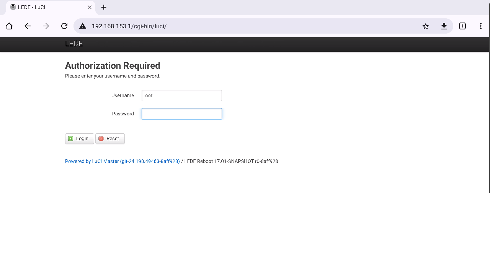
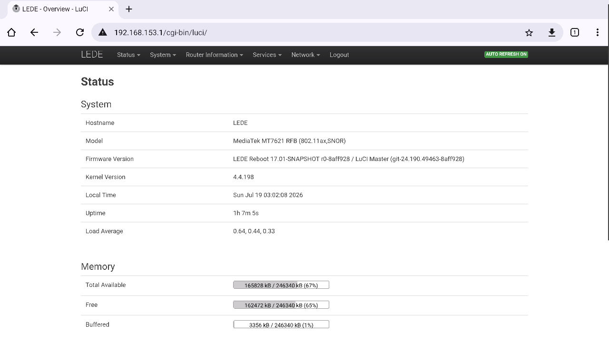
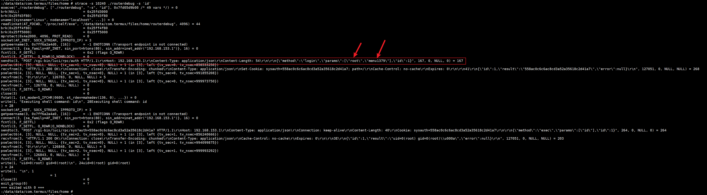

# OpenWrt LEDE系统

* 板载联发科 MT7621

## 登陆方法

* 参考： <https://docs.channel.io/nicemobile-v6cf/ja/articles/%E5%AE%9F%E6%96%BD%E6%89%8B%E9%A0%86-798b5f63>
* web登陆地址：<http://192.168.153.1>
* 账号密码： root/menu1379
* 支持ssh登陆







## openwrt管理工具

```shell
:/data/data/com.termux/files/home # 
:/data/data/com.termux/files/home # md5sum /vendor/bin/routertool                                                                                                         
a55be2222f1d211b19585df1702e5456  /vendor/bin/routertool
:/data/data/com.termux/files/home # md5sum /system/bin/routerdebug                                                                                                        
a55be2222f1d211b19585df1702e5456  /system/bin/routerdebug
:/data/data/com.termux/files/home # 

:/data/data/com.termux/files/home # routerdebug                                                                                                                           
Usage: routerdebug [options]
Options:
    -h "ip address" -n "username" -p "password"; options,had default parameters
    -s "string"; execute shell command
    -u "upgrade file path"; upgrade
    -v ;version
    -l; capture logs
    -l -o "log output path"; capture logs

```

android端游两个命令可用于openwrt管理，两命令内容一样，名称、路径不同

命令中自带了web端的账号密码

```shell
:/data/data/com.termux/files/home # routerdebug -s 'id'                                                                                                                   
Executing shell command: id
uid=0(root) gid=0(root)

:/data/data/com.termux/files/home # routerdebug -s 'who'                                                                                                                  
Executing shell command: who

:/data/data/com.termux/files/home # routerdebug -s 'cat /proc/cpuinfo'                                                                                                    
Executing shell command: cat /proc/cpuinfo
system type		: MediaTek MT7621 ver:1 eco:3
machine			: MediaTek MT7621 RFB (802.11ax,SNOR)
processor		: 0
cpu model		: MIPS 1004Kc V2.15
BogoMIPS		: 586.13
wait instruction	: yes
microsecond timers	: yes
tlb_entries		: 32
extra interrupt vector	: yes
hardware watchpoint	: yes, count: 4, address/irw mask: [0x0ffc, 0x0ffc, 0x0ffb, 0x0ffb]
isa			: mips1 mips2 mips32r1 mips32r2
ASEs implemented	: mips16 dsp mt
shadow register sets	: 1
kscratch registers	: 0
package			: 0
core			: 0
VCED exceptions		: not available
VCEI exceptions		: not available
VPE			: 0

processor		: 1
cpu model		: MIPS 1004Kc V2.15
BogoMIPS		: 586.13
wait instruction	: yes
microsecond timers\u000
600
9: yes
tlb_entries		: 32
extra interrupt vector	: yes
hardware watchpoint	: yes, count: 4, address/irw mask: [0x0ffc, 0x0ffc, 0x0ffb, 0x0ffb]
isa			: mips1 mips2 mips32r1 mips32r2
ASEs implemented	: mips16 dsp mt
shadow register sets	: 1
kscratch registers	: 0
package			: 0
core			: 0
VCED exceptions		: not available
VCEI exceptions		: not available
VPE			: 1

processor		: 2
cpu model		: MIPS 1004Kc V2.15
BogoMIPS		: 586.13
wait instruction	: yes
microsecond timers	: yes
tlb_entries		: 32
extra interrupt vector	: yes
hardware watchpoint	: yes, count: 4, address/irw mask: [0x0ffc, 0x0ffc, 0x0ffb, 0x0ffb]
isa			: mips1 mips2 mips32r1 mips32r2
ASEs implemented	: mips16 dsp mt
shadow register sets	: 1
kscratch registers	: 0
package			: 0
core			: 1
VCED exceptions		: not available
VCEI exceptions		: not available
VPE			: 0

processor		: 3
cpu model		: MIPS 1004Kc V2.15
BogoMIPS		: 586.13
wait instruction	: yes
microsecond timers	: yes
tlb_entries		: 32
extra interrupt vector	: yes
hardware watchpoint\u000
1C7
9: yes, count: 4, address/irw mask: [0x0ffc, 0x0ffc, 0x0ffb, 0x0ffb]
isa			: mips1 mips2 mips32r1 mips32r2
ASEs implemented	: mips16 dsp mt
shadow register sets	: 1
kscratch registers	: 0
package			: 0
core			: 1
VCED exceptions		: not available
VCEI exceptions		: not available
VPE			: 1


```

命令可以直接访问openwrt，可见带有账号密码，用strace跟踪一下就看见了



```shell
sendto(3, "POST /cgi-bin/luci/rpc/auth HTTP/1.1\r\nHost: 192.168.153.1\r\nContent-Type: application/json\r\nContent-Length: 54\r\n\r\n{\"method\":\"login\",\"params\":[\"ro
pselect6(4, [3], NULL, NULL, {tv_sec=1, tv_nsec=0}, NULL) = 1 (in [3], left {tv_sec=0, tv_nsec=856533250})
```


## openwrt管理工具抓取log

```shell
:/data/data/com.termux/files/home # routerdebug  -l -o log                                                                                                                
Capturing log
run cmd:cat /etc/config/wireless

config wifi-iface 'rax0'
	option ifname 'rax0'
	option encryption 'psk2'
	option device 'MT7915D_1_2'
	option hidden '0'
	option vifidx '1'
	option mode 'ap'
	option key 'BAD66641'
	option ssid 'MAXHUB-IRC'
	option disabled '1'

config wifi-iface 'rax1'
	option ifname 'rax1'
	option encryption 'psk2'
	option device 'MT7915D_1_2'
	option hidden '1'
	option vifidx '1'
	option mode 'ap'
	option disabled '0'
	option ssid 'A419E71c8359'
	option key 'b9832992'

config wifi-device 'MT7915D_1_2'
	option IdleTimeout '15'
	option StationKeepAlive '1;1'
	option wifimode '17'
	option HT_OpMode '0'
	option HT_AMSDU '1'
	option VHT_BW_SIGNAL '0'
	option WmmCapable '1'
	option VHT_LDPC '1'
	option VHT_SGI '1'
\
600
u0009option VHT_STBC '1'
	option HT_BADecline '0'
	option HT_GI '1'
	option mode 'ap'
	option HT_LDPC '1'
	option pktaggre '0'
	option band '5G'
	option type 'mediatek'
	option network 'lan'
	option country 'CN'
	option device 'MT7915D_1_2'
	option HT_STBC '1'
	option HT_DisallowTKIP '1'
	option aregion '9'
	option HT_AutoBA '1'
	option txpower '100'
	option bw '80'
	option channel '0'
	option E2pAccessMode '1'
	option vendor 'mediatek'
	option shortslot '1'
	option bgprotect '0'
	option AutoChannelSelect '3'
	option AutoChannelSkipList '52;56;60;64;100;104;108;112;116;120;124;128;132;140;'

config wifi-iface 'ra0'
	option ifname 'ra0'
	option encryption 'psk2'
	option device 'MT7915D_1_1'
	option hidden '0'
	option vifidx '1'
	option mode 'ap'
	option disabled '1'
	option ssid 'AP-2.4G-8964'
	option key 'BAD66641'

config wifi-device 'MT7915D_1_1'
	option IdleTimeout '15'
	option StationKeepAlive '1;1'
	option HT_OpMode '0'
	option HT_BSSCoexistence '1'
	option HT_AMSDU '1'
	option wifimode '16'
	option WmmCapable '1'
	option HT_GI '1'
	option mode 'ap'
	option HT_LDPC '1'

284
	option pktaggre '0'
	option band '2G'
	option type 'mediatek'
	option network 'lan'
	option country 'CN'
	option device 'MT7915D_1_1'
	option HT_STBC '1'
	option HT_DisallowTKIP '1'
	option HT_BADecline '0'
	option HT_AutoBA '1'
	option txpower '100'
	option bw '40'
	option channel '0'
	option E2pAccessMode '1'
	option vendor 'mediatek'
	option shortslot '1'
	option bgprotect '0'
	option AutoChannelSelect '3'
	option region '1'


run cmd:cat /etc/router.version
version=1-0-3-0
compileTime=20240712_092935
sysupgradeTime=none
firewareName=8aff928_20240712_092935_1-0-3-0-mt7621-squashfs-sysupgrade.bin
checkSum=none
commitId=8aff928
flashSize=16M
branch=master
machineName=common
customerName=vx60
platformVersion=none
configVersion=none
buildVersion=none

run cmd:cat /etc/config/routerinfo
config router 'info'
      option version '1-0-3-0'
      option compileTime '20240712_092935'
      option sysupgradeTime 'none'
      option firewareName '8aff928_20240712_092935_1-0-3-0-mt7621-squashfs-sysupgrade.bin'
      option checkSum 'none'
      option commitId '8aff928'
      option flashSize '16M'
      option branch 'master'
      option machineName 'common'
      option customerName 'vx60'
      option platformVersion 'none'
      option configVersion 'none'
      option buildVersion 'none'
      option otakey '6f42bdc50735db15d19a53b854d798543cff8877'
      option ubootVersion 'none'

run cmd:cat /tmp/dhcp.leases
config router 'info'
      option version '1-0-3-0'
      option compileTime '20240712_092935'
      option sysupgradeTime 'none'
      option firewareName '8aff928_20240712_092935_1-0-3-0-mt7621-squashfs-sysupgrade.bin'
      option checkSum 'none'
      option commitId '8aff928'
      option flashSize '16M'
      option branch 'master'
      option machineName 'common'
      option customerName 'vx60'
      option platformVersion 'none'
      option configVersion 'none'
      option buildVersion 'none'
      option otakey '6f42bdc50735db15d19a53b854d798543cff8877'
      option ubootVersion 'none'

run cmd:lspci
00:00.0 Class 0604: 0e8d:0801
00:01.0 Class 0604: 0e8d:0801
01:00.0 Class 0002: 14c3:7916
02:00.0 Class 0002: 14c3:7915

run cmd:ps
  PID USER       VSZ STAT COMMAND
    1 root      1548 S    /sbin/procd
    2 root         0 SW   [kthreadd]
    3 root         0 SW   [ksoftirqd/0]
    4 root         0 SW   [kworker/0:0]
    5 root         0 SW<  [kworker/0:0H]
    7 root         0 SW   [rcu_sched]
    8 root         0 SW   [rcu_bh]
    9 root         0 SW   [migration/0]
   10 root         0 SW   [migration/1]
   11 root         0 SW   [ksoftirqd/1]
   13 root         0 SW<  [kworker/1:0H]
   14 root         0 SW   [migration/2]
   15 root         0 SW   [ksoftirqd/2]
   17 root         0 SW<  [kworker/2:0H]
   18 root         0 SW   [migration/3]
   19 root         0 SW   [ksoftirqd/3]
   20 root         0 SW   [kworker/3:0]
   21 root         0 SW<  [kworker/3:0H]
   25 root         0 SW   [kworker/u8:2]
  124 root         0 SW<  [writeback]
  126 root         0 SW<  [crypto]
  127 root         0 SW<  [bioset]\u
600
000a  129 root         0 SW<  [kblockd]
  166 root         0 SW   [kworker/1:1]
  177 root         0 SW   [kswapd0]
  178 root         0 SW<  [vmstat]
  236 root         0 SW   [fsnotify_mark]
  238 root         0 SW<  [SquashFS read w]
  246 root         0 SW<  [pencrypt]
  248 root         0 SW<  [pdecrypt]
  285 root         0 SW   [spi32766]
  286 root         0 SW   [kworker/0:1]
  290 root         0 SW<  [bioset]
  295 root         0 SW<  [bioset]
  300 root         0 SW<  [bioset]
  305 root         0 SW<  [bioset]
  310 root         0 SW<  [bioset]
  315 root         0 SW<  [bioset]
  320 root         0 SW<  [bioset]
  359 root         0 SW<  [ipv6_addrconf]
  365 root         0 SW<  [deferwq]
  369 root         0 SW<  [kworker/1:1H]
  371 root         0 SW   [kworker/1:2]
  373 root         0 SW   [kworker/3:1]
  374 root         0 SW<  [kworker/0:1H]
  377 root         0 SW<  [kworker/2:1H]
  378 root         0 SW   [kworker/2:2]
  416 root         0 SW<  [kworker/3:1H]
  498 root         0 SWN  [jffs2_gcd_mtd6]
  579 root      1184 S    /sbin/ubusd
  580 root       900 S    /sbin/askfirst /usr/libexec/login.sh
  750 root         0 SW   [irq/26-1e004000]
  751 root         0 SW<  [wq_eip93]
  938 root       912 S    fwdd -p ra0 apcli0 -p ra1 apcli0 -p ra2 apcli0 -p ra
  996 root      1272 S    /sbin/logd -S 64
 1005 root      1448 S    /sb
56C
in/rpcd
 1056 root      1444 S    /usr/sbin/iwevent
 1074 root      2608 S    /usr/sbin/queue_cmd_event
 1255 root      1624 S    /sbin/netifd
 1290 root      1424 S    /usr/sbin/odhcpd
 1351 root         0 Z    [hotplug-call]
 1369 root         0 SW   [RtmpCmdQTask]
 1371 root         0 SW   [RtmpWscTask]
 1372 root         0 SW   [HwCtrlTask]
 1373 root         0 SW   [ser_task]
 1411 root      1068 S    /usr/sbin/dropbear -F -P /var/run/dropbear.1.pid -p
 1469 root         0 SW   [kworker/2:3]
 1528 root         0 SW   [RtmpMlmeTask]
 1867 root      7796 S    smbd
 1879 root      6456 S    nmbd
 1942 dnsmasq   1296 S    /usr/sbin/dnsmasq -C /var/etc/dnsmasq.conf.cfg02411c
 1968 root       976 S    xl2tpd -D -l -p /var/run/xl2tpd.pid
 1977 root      1208 S    /usr/sbin/telnetd
 2263 root      3560 S    /usr/sbin/uhttpd -f -h /www -r LEDE -x /cgi-bin -u /
 2376 root      4136 S    /usr/sbin/smartdns -f -c /var/etc/smartdns/smartdns.
 2407 root      1208 S <  /usr/sbin/ntpd -n -N -S /usr/sbin/ntpd-hotplug -p 0.
 4415 root         0 SW   [kworker/u8:0]
 4862 root      2676 S    /www/cgi-bin/ssehttp
 4929 root      2764 S    {luci} /usr/bin/lua /www/cgi-bin/luci
 4930 root      1208 S    sh -c ps
 4931 root      1208 R    ps

run cmd:logread | tail -n 100
Sun Jul 19 01:56:34 2026 kern.warn kernel: [   90.977192] phy_oper_init(): operate TxStream = 2, RxStream = 2
Sun Jul 19 01:56:34 2026 kern.warn kernel: [   90.984309] Caller: wlan_operate_init+0x104/0x118
Sun Jul 19 01:56:34 2026 kern.warn kernel: [   90.989948] 
Sun Jul 19 01:56:34 2026 kern.warn kernel: [   90.989948] phy_mode=177, ch=149, wdev_type=1
Sun Jul 19 01:56:34 2026 kern.warn kernel: [   90.996782] ht_cap: ht_cap->HtCapInfo, 
Sun Jul 19 01:56:34 2026 kern.warn kernel: [   91.001304] ldpc=1,ch_width=1,gf=0,sgi20=1,sgi40=1,tx_stbc=1,rx_stbc=1,amsdu_size=1
Sun Jul 19 01:56:34 2026 kern.warn kernel: [   91.010253] ht_cap: ht_cap->HtCapParm, 
Sun Jul 19 01:56:34 2026 kern.warn kernel: [   91.014750] mdpu_density=5, ampdu_factor=3
Sun Jul 19 01:56:34 2026 kern.warn kernel: [   91.019802] hw_ctrl_flow_v2_open: wdev_idx=1
Sun Jul 19 01:56:34 2026 kern.warn kernel: [   91.024334] AP inf up for ra_1(func_idx) OmacIdx=0
Sun Jul 19 01:56:34 
600
2026 kern.warn kernel: [   91.030025] AsicRadioOnOffCtrl(): DbdcIdx=1 RadioOn
Sun Jul 19 01:56:34 2026 kern.warn kernel: [   91.035306] ApAutoChannelAtBootUp----------------->
Sun Jul 19 01:56:34 2026 kern.warn kernel: [   91.041043] ApAutoChannelAtBootUp: AutoChannelBootup[1] = 1
Sun Jul 19 01:56:34 2026 kern.warn kernel: [   91.047767] MtCmdSetMacTxRx:(ret = 0)
Sun Jul 19 01:56:34 2026 kern.warn kernel: [   91.052369] MtCmdSetMacTxRx:(ret = 0)
Sun Jul 19 01:56:34 2026 kern.warn kernel: [   91.056689] \u001b[41m ap_run_at_boot() : ACS is disable !!\u001b[m
Sun Jul 19 01:56:34 2026 kern.warn kernel: [   91.063065] ===> APStartUpForMbss(caller:ap_inf_open+0x178/0x1d4), mbss_idx:1, CfgMode:177
Sun Jul 19 01:56:34 2026 kern.warn kernel: [   91.072779] [PMF]APPMFInit:: apidx=1, MFPC=1, MFPR=0, SHA256=0
Sun Jul 19 01:56:34 2026 kern.warn kernel: [   91.079614] [PMF]PMF_MakeRsnIeGMgmtCipher: Insert BIP to the group management cipher of RSNIE
Sun Jul 19 01:56:34 2026 kern.warn kernel: [   91.088237] Caller: SetCommonHT+0x100/0x170
Sun Jul 19 01:56:34 2026 kern.warn kernel: [   91.094562] 
Sun Jul 19 01:56:34 2026 kern.warn kernel: [   91.094562] phy_mode=177, ch=149, wdev_type=1
Sun Jul 19 01:56:34 2026 kern.warn kernel: [   91.101424] ht_cap: ht_cap->HtCapInfo, 
Sun Jul 19 01:56:34 2026 kern.warn kernel: [   91.105911] ldpc=1,ch_width=1,gf=0,sgi20=1,sgi40=1,tx_stbc=1,rx_stbc=1,amsdu_size=1
Sun Jul 19 01:56:34 2026 kern.warn kernel: [   91.114900] h
600
t_cap: ht_cap->HtCapParm, 
Sun Jul 19 01:56:34 2026 kern.warn kernel: [   91.119521] mdpu_density=5, ampdu_factor=3
Sun Jul 19 01:56:34 2026 kern.warn kernel: [   91.124342] Enable 20/40 BSSCoex Channel Scan(BssCoex=1)
Sun Jul 19 01:56:34 2026 kern.warn kernel: [   91.130597] ap_link_up(caller:APStartUpForMbss+0x430/0x6b8), wdev(1)
Sun Jul 19 01:56:34 2026 kern.warn kernel: [   91.138035] wifi_sys_linkup, wdev idx = 1
Sun Jul 19 01:56:35 2026 kern.warn kernel: [   91.332275] wtc_acquire_groupkey_wcid: Found a non-occupied wtbl_idx:286 for WDEV_TYPE:1
Sun Jul 19 01:56:35 2026 kern.warn kernel: [   91.332275]  LinkToOmacIdx = 0, LinkToWdevType = 1
Sun Jul 19 01:56:35 2026 kern.warn kernel: [   91.347214] TRTableInsertMcastEntry:band1 group_idx[1]=1
Sun Jul 19 01:56:35 2026 kern.warn kernel: [   91.353459] wifi_sys_linkup:wdev(type=1,func_idx=1,wdev_idx=1),BssIndex(1)
Sun Jul 19 01:56:35 2026 kern.warn kernel: [   91.361549] hw_ctrl_flow_v2_link_up: wdev_idx=1
Sun Jul 19 01:56:35 2026 kern.warn kernel: [   91.366116] (bssUpdateChannel), ucPrimCh=149, ucCentChSeg0=155, ucCentChSeg1=0, BW=2, ucHetbRU26Disable=0, ucHetbAllDisable=1
Sun Jul 19 01:56:35 2026 kern.warn kernel: [   91.377512] bssUpdateBmcMngRate (BSS_INFO_BROADCAST_INFO), CmdBssInfoBmcRate.u2BcTransmit= 8320, CmdBssInfoBmcRate.u2McTransmit = 8320
Sun Jul 19 01:56:35 2026 kern.warn kernel: [   91.393979] UpdateBeaconHandler, BCN_UPDATE_INIT, OmacIdx = 0 (ra0)
Sun Jul 19 01:56:35 2026 kern.wa
600
rn kernel: [   91.400384] bcn_buf_init():BcnPkt is allocated!, bcn offload=1
Sun Jul 19 01:56:35 2026 kern.warn kernel: [   91.406303] MtCmdTxPowerSKUCtrl: tx_pwr_sku_en: 0, BandIdx: 1
Sun Jul 19 01:56:35 2026 kern.warn kernel: [   91.413251] MtCmdTxBfBackoffCtrl: fgTxBFBackoffEn: 0, BandIdx: 1
Sun Jul 19 01:56:35 2026 kern.warn kernel: [   91.420354] MtCmdTxPowerPercentCtrl: fgTxPowerPercentEn: 0, BandIdx: 1
Sun Jul 19 01:56:35 2026 kern.warn kernel: [   91.435308] set muru_update_he_cfg()!!!!
Sun Jul 19 01:56:35 2026 kern.warn kernel: [   91.439296] PrintSrCmd:
Sun Jul 19 01:56:35 2026 kern.warn kernel: [   91.439296] u1CmdSubId = 1, u1ArgNum = 0, u1DbdcIdx = 1, u1Status = 0
Sun Jul 19 01:56:35 2026 kern.warn kernel: [   91.439296] u1DropTaIdx = 0, u1StaIdx = 0, u4Value = 0
Sun Jul 19 01:56:35 2026 kern.warn kernel: [   91.453444] PrintSrCmd:
Sun Jul 19 01:56:35 2026 kern.warn kernel: [   91.453444] u1CmdSubId = 5, u1ArgNum = 0, u1DbdcIdx = 1, u1Status = 0
Sun Jul 19 01:56:35 2026 kern.warn kernel: [   91.453444] u1DropTaIdx = 0, u1StaIdx = 0, u4Value = 0
Sun Jul 19 01:56:35 2026 kern.warn kernel: [   91.467523] PrintSrCmd:
Sun Jul 19 01:56:35 2026 kern.warn kernel: [   91.467523] u1CmdSubId = 3, u1ArgNum = 0, u1DbdcIdx = 1, u1Status = 0
Sun Jul 19 01:56:35 2026 kern.warn kernel: [   91.467523] u1DropTaIdx = 0, u1StaIdx = 0, u4Value = 1
Sun Jul 19 01:56:35 2026 kern.warn kernel: [   91.481716] PrintSrCmd:
Sun Jul 19 01:56:35 2026 kern.
600
warn kernel: [   91.481716] u1CmdSubId = 23, u1ArgNum = 0, u1DbdcIdx = 1, u1Status = 0
Sun Jul 19 01:56:35 2026 kern.warn kernel: [   91.481716] u1DropTaIdx = 0, u1StaIdx = 0, u4Value = 1
Sun Jul 19 01:56:35 2026 kern.warn kernel: [   91.496013] apidx 1 for WscUUIDInit
Sun Jul 19 01:56:35 2026 kern.warn kernel: [   91.499549] Generate UUID for apidx(1)
Sun Jul 19 01:56:35 2026 kern.warn kernel: [   91.503323] WDS_Init():wds_num[1]=0, count=0, MAX_WDS_ENTRY=16, if_idx=0, flg_wds_init=0
Sun Jul 19 01:56:35 2026 kern.warn kernel: [   91.511502] Total allocated 0 WDS(es) for band1!
Sun Jul 19 01:56:35 2026 daemon.notice netifd: Network device 'rax0' link is up
Sun Jul 19 01:56:35 2026 kern.info kernel: [   91.516372] extif_set_dev(rax0)
Sun Jul 19 01:56:35 2026 kern.info kernel: [   91.525357] device rax0 entered promiscuous mode
Sun Jul 19 01:56:35 2026 kern.info kernel: [   91.530458] br-lan: port 4(rax0) entered forwarding state
Sun Jul 19 01:56:35 2026 kern.info kernel: [   91.535977] br-lan: port 4(rax0) entered forwarding state
Sun Jul 19 01:56:35 2026 kern.info kernel: [   91.593302] extif_put_dev(rax0)
Sun Jul 19 01:56:35 2026 kern.warn kernel: [   91.598261] rax0: ===> mbss_virtual_if_close
Sun Jul 19 01:56:35 2026 kern.warn kernel: [   91.602674] RTMP_COM_IoctlHandle -> CMD_RTPRIV_IOCTL_VIRTUAL_INF_DOWN
Sun Jul 19 01:56:35 2026 kern.warn kernel: [   91.609211] ap_link_down(caller:ap_inf_close+0x40/0x138), wdev(1)
Sun Jul 19 01:56:3
600
5 2026 kern.warn kernel: [   91.615483] UpdateBeaconHandler, wdev(1) bss not ready (state:2, caller:ap_link_down+0xa0/0x100)!!
Sun Jul 19 01:56:35 2026 kern.warn kernel: [   91.624497] wifi_sys_linkdown(), wdev idx = 1
Sun Jul 19 01:56:35 2026 kern.warn kernel: [   91.628876] wifi_sys_linkdown:wdev(type=1,func_idx=1,wdev_idx=1),BssIndex(1)
Sun Jul 19 01:56:35 2026 kern.warn kernel: [   91.636109] hw_ctrl_flow_v2_link_down: wdev_idx=1
Sun Jul 19 01:56:35 2026 kern.warn kernel: [   91.642107] (bssUpdateChannel), ucPrimCh=149, ucCentChSeg0=155, ucCentChSeg1=0, BW=2, ucHetbRU26Disable=0, ucHetbAllDisable=1
Sun Jul 19 01:56:35 2026 kern.warn kernel: [   91.653786] bssUpdateBmcMngRate (BSS_INFO_BROADCAST_INFO), CmdBssInfoBmcRate.u2BcTransmit= 0, CmdBssInfoBmcRate.u2McTransmit = 0
Sun Jul 19 01:56:35 2026 kern.warn kernel: [   91.667882] wifi_sys_close, wdev idx = 1
Sun Jul 19 01:56:35 2026 kern.warn kernel: [   91.672012] hw_ctrl_flow_v2_close: wdev_idx=1
Sun Jul 19 01:56:35 2026 kern.warn kernel: [   91.676710] RTMP_COM_IoctlHandle -> CMD_RTPRIV_IOCTL_VIRTUAL_INF_DEINIT
Sun Jul 19 01:56:35 2026 daemon.notice netifd: Network device 'rax0' link is down
Sun Jul 19 01:56:35 2026 kern.info kernel: [   91.683748] br-lan: port 4(rax0) entered disabled state
Sun Jul 19 01:56:35 2026 kern.info kernel: [   91.696073] device rax0 left promiscuous mode
Sun Jul 19 01:56:35 2026 kern.info kernel: [   91.701568] br-lan: port 4(rax0) entered disabled state
Sun Jul 19 
600
01:56:35 2026 user.warn kernel: [   91.877966] ===mt7615.sh mt7615.sh reload MT7915D_1_1 end
Sun Jul 19 02:03:30 2026 daemon.info odhcpd[1290]: Using a RA lifetime of 0 seconds on br-lan
Sun Jul 19 02:10:13 2026 daemon.info odhcpd[1290]: Using a RA lifetime of 0 seconds on br-lan
Sun Jul 19 02:10:18 2026 kern.info kernel: [  196.347983] mapfilter:drop IP addr timeout! stop dropping IP addr.
Sun Jul 19 02:10:18 2026 kern.warn kernel: [  914.991795] UpdateBeaconHandler, wdev(1) bss not ready (state:0, caller:Set_COUSTOM_IE_Proc+0x42c/0x4d4)!!
Sun Jul 19 02:14:19 2026 daemon.info odhcpd[1290]: Using a RA lifetime of 0 seconds on br-lan
Sun Jul 19 02:21:32 2026 daemon.info odhcpd[1290]: Using a RA lifetime of 0 seconds on br-lan
Sun Jul 19 02:25:18 2026 kern.warn kernel: [ 1814.827098] UpdateBeaconHandler, wdev(1) bss not ready (state:0, caller:Set_COUSTOM_IE_Proc+0x42c/0x4d4)!!
Sun Jul 19 02:29:09 2026 daemon.info odhcpd[1290]: Using a RA lifetime of 0 seconds on br-lan
Sun Jul 19 02:34:34 2026 daemon.info odhcpd[1290]: Using a RA lifetime of 0 seconds on br-lan
Sun Jul 19 02:40:18 2026 kern.warn kernel: [ 2714.957707] UpdateBeaconHandler, wdev(1) bss not ready (state:0, caller:Set_COUSTOM_IE_Proc+0x42c/0x4d4)!!
Sun Jul 19 02:40:32 2026 daemon.info odhcpd[1290]: Using a RA lifetime of 0 seconds on br-lan
Sun Jul 19 02:44:46 2026 daemon.info odhcpd[1290]: Using a RA lifetime of 0 seconds on br-lan
Sun Jul 19 02:52:53 2026 daemon.info odhcpd[1290]: Usi
2EB
ng a RA lifetime of 0 seconds on br-lan
Sun Jul 19 02:55:18 2026 kern.warn kernel: [ 3615.055607] UpdateBeaconHandler, wdev(1) bss not ready (state:0, caller:Set_COUSTOM_IE_Proc+0x42c/0x4d4)!!
Sun Jul 19 03:01:29 2026 daemon.info odhcpd[1290]: Using a RA lifetime of 0 seconds on br-lan
Sun Jul 19 03:06:18 2026 daemon.err uhttpd[2263]: sh: who: not found
Sun Jul 19 03:09:57 2026 daemon.info odhcpd[1290]: Using a RA lifetime of 0 seconds on br-lan
Sun Jul 19 03:10:18 2026 kern.warn kernel: [ 4515.114022] UpdateBeaconHandler, wdev(1) bss not ready (state:0, caller:Set_COUSTOM_IE_Proc+0x42c/0x4d4)!!
Sun Jul 19 03:13:39 2026 daemon.info odhcpd[1290]: Using a RA lifetime of 0 seconds on br-lan

run cmd:dmesg | tail -n 100
[   90.096318] hw_ctrl_flow_v2_link_down: wdev_idx=0
[   90.102128] (bssUpdateChannel), ucPrimCh=8, ucCentChSeg0=10, ucCentChSeg1=0, BW=1, ucHetbRU26Disable=0, ucHetbAllDisable=1
[   90.113382] bssUpdateBmcMngRate (BSS_INFO_BROADCAST_INFO), CmdBssInfoBmcRate.u2BcTransmit= 0, CmdBssInfoBmcRate.u2McTransmit = 0
[   90.127328] wifi_sys_close, wdev idx = 0
[   90.131495] hw_ctrl_flow_v2_close: wdev_idx=0
[   90.136100] RTMP_COM_IoctlHandle -> CMD_RTPRIV_IOCTL_VIRTUAL_INF_DEINIT
[   90.143113] br-lan: port 4(ra0) entered disabled state
[   90.155342] device ra0 left promiscuous mode
[   90.160732] br-lan: port 4(ra0) entered disabled state
[   90.938963] rax0: ===> mbss_virtual_if_open
[   90.943988] RTMP_COM_IoctlHandle -> CMD_RTPRIV_IOCTL_VIRTUAL_INF_INIT
[   90.951529] RTMP_COM_IoctlHandle -> CMD_RTPRIV_IOCTL_VIRTUAL_INF_UP
[   90.958845] wifi_sys_open(), wdev idx = 1
[   90.963731] ucAction = 0, ucBandIdx = 0, ucSmthIntlBypass =
600
 0
[   90.970418] ucAction = 0, ucBandIdx = 1, ucSmthIntlBypass = 0
[   90.977192] phy_oper_init(): operate TxStream = 2, RxStream = 2
[   90.984309] Caller: wlan_operate_init+0x104/0x118
[   90.989948] 
[   90.989948] phy_mode=177, ch=149, wdev_type=1
[   90.996782] ht_cap: ht_cap->HtCapInfo, 
[   91.001304] ldpc=1,ch_width=1,gf=0,sgi20=1,sgi40=1,tx_stbc=1,rx_stbc=1,amsdu_size=1
[   91.010253] ht_cap: ht_cap->HtCapParm, 
[   91.014750] mdpu_density=5, ampdu_factor=3
[   91.019802] hw_ctrl_flow_v2_open: wdev_idx=1
[   91.024334] AP inf up for ra_1(func_idx) OmacIdx=0
[   91.030025] AsicRadioOnOffCtrl(): DbdcIdx=1 RadioOn
[   91.035306] ApAutoChannelAtBootUp----------------->
[   91.041043] ApAutoChannelAtBootUp: AutoChannelBootup[1] = 1
[   91.047767] MtCmdSetMacTxRx:(ret = 0)
[   91.052369] MtCmdSetMacTxRx:(ret = 0)
[   91.056689] \u001b[41m ap_run_at_boot() : ACS is disable !!\u001b[m
[   91.063065] ===> APStartUpForMbss(caller:ap_inf_open+0x178/0x1d4), mbss_idx:1, CfgMode:177
[   91.072779] [PMF]APPMFInit:: apidx=1, MFPC=1, MFPR=0, SHA256=0
[   91.079614] [PMF]PMF_MakeRsnIeGMgmtCipher: Insert BIP to the group management cipher of RSNIE
[   91.088237] Caller: SetCommonHT+0x100/0x170
[   91.094562] 
[   91.094562] phy_mode=177, ch=149, wdev_type=1
[   91.101424] ht_cap: ht_cap->HtCapInfo, 
[   91.105911] ldpc=1,ch_width=1,gf=0,sgi20=1,sgi40=1,tx_stbc=1,rx_stbc=1,amsdu_size=1
[   91.
600
114900] ht_cap: ht_cap->HtCapParm, 
[   91.119521] mdpu_density=5, ampdu_factor=3
[   91.124342] Enable 20/40 BSSCoex Channel Scan(BssCoex=1)
[   91.130597] ap_link_up(caller:APStartUpForMbss+0x430/0x6b8), wdev(1)
[   91.138035] wifi_sys_linkup, wdev idx = 1
[   91.332275] wtc_acquire_groupkey_wcid: Found a non-occupied wtbl_idx:286 for WDEV_TYPE:1
[   91.332275]  LinkToOmacIdx = 0, LinkToWdevType = 1
[   91.347214] TRTableInsertMcastEntry:band1 group_idx[1]=1
[   91.353459] wifi_sys_linkup:wdev(type=1,func_idx=1,wdev_idx=1),BssIndex(1)
[   91.361549] hw_ctrl_flow_v2_link_up: wdev_idx=1
[   91.366116] (bssUpdateChannel), ucPrimCh=149, ucCentChSeg0=155, ucCentChSeg1=0, BW=2, ucHetbRU26Disable=0, ucHetbAllDisable=1
[   91.377512] bssUpdateBmcMngRate (BSS_INFO_BROADCAST_INFO), CmdBssInfoBmcRate.u2BcTransmit= 8320, CmdBssInfoBmcRate.u2McTransmit = 8320
[   91.393979] UpdateBeaconHandler, BCN_UPDATE_INIT, OmacIdx = 0 (ra0)
[   91.400384] bcn_buf_init():BcnPkt is allocated!, bcn offload=1
[   91.406303] MtCmdTxPowerSKUCtrl: tx_pwr_sku_en: 0, BandIdx: 1
[   91.413251] MtCmdTxBfBackoffCtrl: fgTxBFBackoffEn: 0, BandIdx: 1
[   91.420354] MtCmdTxPowerPercentCtrl: fgTxPowerPercentEn: 0, BandIdx: 1
[   91.435308] set muru_update_he_cfg()!!!!
[   91.439296] PrintSrCmd:
[   91.439296] u1CmdSubId = 1, u1ArgNum = 0, u1DbdcIdx = 1, u1Status = 0
[   91.439296] u1DropTaIdx = 0, u1StaIdx = 0, u4Value = 0
[   91.453444] PrintSrCm
600
d:
[   91.453444] u1CmdSubId = 5, u1ArgNum = 0, u1DbdcIdx = 1, u1Status = 0
[   91.453444] u1DropTaIdx = 0, u1StaIdx = 0, u4Value = 0
[   91.467523] PrintSrCmd:
[   91.467523] u1CmdSubId = 3, u1ArgNum = 0, u1DbdcIdx = 1, u1Status = 0
[   91.467523] u1DropTaIdx = 0, u1StaIdx = 0, u4Value = 1
[   91.481716] PrintSrCmd:
[   91.481716] u1CmdSubId = 23, u1ArgNum = 0, u1DbdcIdx = 1, u1Status = 0
[   91.481716] u1DropTaIdx = 0, u1StaIdx = 0, u4Value = 1
[   91.496013] apidx 1 for WscUUIDInit
[   91.499549] Generate UUID for apidx(1)
[   91.503323] WDS_Init():wds_num[1]=0, count=0, MAX_WDS_ENTRY=16, if_idx=0, flg_wds_init=0
[   91.511502] Total allocated 0 WDS(es) for band1!
[   91.516372] extif_set_dev(rax0)
[   91.525357] device rax0 entered promiscuous mode
[   91.530458] br-lan: port 4(rax0) entered forwarding state
[   91.535977] br-lan: port 4(rax0) entered forwarding state
[   91.593302] extif_put_dev(rax0)
[   91.598261] rax0: ===> mbss_virtual_if_close
[   91.602674] RTMP_COM_IoctlHandle -> CMD_RTPRIV_IOCTL_VIRTUAL_INF_DOWN
[   91.609211] ap_link_down(caller:ap_inf_close+0x40/0x138), wdev(1)
[   91.615483] UpdateBeaconHandler, wdev(1) bss not ready (state:2, caller:ap_link_down+0xa0/0x100)!!
[   91.624497] wifi_sys_linkdown(), wdev idx = 1
[   91.628876] wifi_sys_linkdown:wdev(type=1,func_idx=1,wdev_idx=1),BssIndex(1)
[   91.636109] hw_ctrl_flow_v2_link_down: wdev_idx=1
[   91.642107] (b
546
ssUpdateChannel), ucPrimCh=149, ucCentChSeg0=155, ucCentChSeg1=0, BW=2, ucHetbRU26Disable=0, ucHetbAllDisable=1
[   91.653786] bssUpdateBmcMngRate (BSS_INFO_BROADCAST_INFO), CmdBssInfoBmcRate.u2BcTransmit= 0, CmdBssInfoBmcRate.u2McTransmit = 0
[   91.667882] wifi_sys_close, wdev idx = 1
[   91.672012] hw_ctrl_flow_v2_close: wdev_idx=1
[   91.676710] RTMP_COM_IoctlHandle -> CMD_RTPRIV_IOCTL_VIRTUAL_INF_DEINIT
[   91.683748] br-lan: port 4(rax0) entered disabled state
[   91.696073] device rax0 left promiscuous mode
[   91.701568] br-lan: port 4(rax0) entered disabled state
[   91.877966] ===mt7615.sh mt7615.sh reload MT7915D_1_1 end
[  196.347983] mapfilter:drop IP addr timeout! stop dropping IP addr.
[  914.991795] UpdateBeaconHandler, wdev(1) bss not ready (state:0, caller:Set_COUSTOM_IE_Proc+0x42c/0x4d4)!!
[ 1814.827098] UpdateBeaconHandler, wdev(1) bss not ready (state:0, caller:Set_COUSTOM_IE_Proc+0x42c/0x4d4)!!
[ 2714.957707] UpdateBeaconHandler, wdev(1) bss not ready (state:0, caller:Set_COUSTOM_IE_Proc+0x42c/0x4d4)!!
[ 3615.055607] UpdateBeaconHandler, wdev(1) bss not ready (state:0, caller:Set_COUSTOM_IE_Proc+0x42c/0x4d4)!!
[ 4515.114022] UpdateBeaconHandler, wdev(1) bss not ready (state:0, caller:Set_COUSTOM_IE_Proc+0x42c/0x4d4)!!

run cmd:uci show wireless
wireless.rax0=wifi-iface
wireless.rax0.ifname='rax0'
wireless.rax0.encryption='psk2'
wireless.rax0.device='MT7915D_1_2'
wireless.rax0.hidden='0'
wireless.rax0.vifidx='1'
wireless.rax0.mode='ap'
wireless.rax0.key='BAD66641'
wireless.rax0.ssid='MAXHUB-IRC'
wireless.rax0.disabled='1'
wireless.rax1=wifi-iface
wireless.rax1.ifname='rax1'
wireless.rax1.encryption='psk2'
wireless.rax1.device='MT7915D_1_2'
wireless.rax1.hidden='1'
wireless.rax1.vifidx='1'
wireless.rax1.mode='ap'
wireless.rax1.disabled='0'
wireless.rax1.ssid='A419E71c8359'
wireless.rax1.key='b9832992'
wireless.MT7915D_1_2=wifi-device
wireless.MT7915D_1_2.IdleTimeout='15'
wireless.MT7915D_1_2.StationKeepAlive='1;1'
wireless.MT7915D_1_2.wifimode='17'
wireless.MT7915D_1_2.HT_OpMode='0'
wireless.MT7915D_1_2.HT_AMSDU='1'
wireless.MT7915D_1_2.VHT_BW_SIGNAL='0'
wireless.MT7915D_1_2.WmmCapable='1'
wirele
600
ss.MT7915D_1_2.VHT_LDPC='1'
wireless.MT7915D_1_2.VHT_SGI='1'
wireless.MT7915D_1_2.VHT_STBC='1'
wireless.MT7915D_1_2.HT_BADecline='0'
wireless.MT7915D_1_2.HT_GI='1'
wireless.MT7915D_1_2.mode='ap'
wireless.MT7915D_1_2.HT_LDPC='1'
wireless.MT7915D_1_2.pktaggre='0'
wireless.MT7915D_1_2.band='5G'
wireless.MT7915D_1_2.type='mediatek'
wireless.MT7915D_1_2.network='lan'
wireless.MT7915D_1_2.country='CN'
wireless.MT7915D_1_2.device='MT7915D_1_2'
wireless.MT7915D_1_2.HT_STBC='1'
wireless.MT7915D_1_2.HT_DisallowTKIP='1'
wireless.MT7915D_1_2.aregion='9'
wireless.MT7915D_1_2.HT_AutoBA='1'
wireless.MT7915D_1_2.txpower='100'
wireless.MT7915D_1_2.bw='80'
wireless.MT7915D_1_2.channel='0'
wireless.MT7915D_1_2.E2pAccessMode='1'
wireless.MT7915D_1_2.vendor='mediatek'
wireless.MT7915D_1_2.shortslot='1'
wireless.MT7915D_1_2.bgprotect='0'
wireless.MT7915D_1_2.AutoChannelSelect='3'
wireless.MT7915D_1_2.AutoChannelSkipList='52;56;60;64;100;104;108;112;116;120;124;128;132;140;'
wireless.ra0=wifi-iface
wireless.ra0.ifname='ra0'
wireless.ra0.encryption='psk2'
wireless.ra0.device='MT7915D_1_1'
wireless.ra0.hidden='0'
wireless.ra0.vifidx='1'
wireless.ra0.mode='ap'
wireless.ra0.disabled='1'
wireless.ra0.ssid='AP-2.4G-8964'
wireless.ra0.key='BAD66641'
wireless.MT7915D_1_1=wifi-device
wireless.MT7915D_1_1.IdleTimeout='15'
wireless.MT7915D_1_1.StationKeepAli
462
ve='1;1'
wireless.MT7915D_1_1.HT_OpMode='0'
wireless.MT7915D_1_1.HT_BSSCoexistence='1'
wireless.MT7915D_1_1.HT_AMSDU='1'
wireless.MT7915D_1_1.wifimode='16'
wireless.MT7915D_1_1.WmmCapable='1'
wireless.MT7915D_1_1.HT_GI='1'
wireless.MT7915D_1_1.mode='ap'
wireless.MT7915D_1_1.HT_LDPC='1'
wireless.MT7915D_1_1.pktaggre='0'
wireless.MT7915D_1_1.band='2G'
wireless.MT7915D_1_1.type='mediatek'
wireless.MT7915D_1_1.network='lan'
wireless.MT7915D_1_1.country='CN'
wireless.MT7915D_1_1.device='MT7915D_1_1'
wireless.MT7915D_1_1.HT_STBC='1'
wireless.MT7915D_1_1.HT_DisallowTKIP='1'
wireless.MT7915D_1_1.HT_BADecline='0'
wireless.MT7915D_1_1.HT_AutoBA='1'
wireless.MT7915D_1_1.txpower='100'
wireless.MT7915D_1_1.bw='40'
wireless.MT7915D_1_1.channel='0'
wireless.MT7915D_1_1.E2pAccessMode='1'
wireless.MT7915D_1_1.vendor='mediatek'
wireless.MT7915D_1_1.shortslot='1'
wireless.MT7915D_1_1.bgprotect='0'
wireless.MT7915D_1_1.AutoChannelSelect='3'
wireless.MT7915D_1_1.region='1'

run cmd:uci show network
network.loopback=interface
network.loopback.ifname='lo'
network.loopback.proto='static'
network.loopback.ipaddr='127.0.0.1'
network.loopback.netmask='255.0.0.0'
network.globals=globals
network.globals.ula_prefix='fd70:a70d:63f5::/48'
network.lan=interface
network.lan.type='bridge'
network.lan.proto='static'
network.lan.ipaddr='192.168.153.1'
network.lan.gateway='192.168.153.254'
network.lan.netmask='255.255.255.0'
network.lan.dns='192.168.153.254 8.8.8.8 9.9.9.9'
network.lan.ip6assign='60'
network.lan.ifname='eth0 eth1 ra0 rax0'
network.lan.macaddr='C0:8A:CD:56:39:49'
network.@switch[0]=switch
network.@switch[0].name='switch0'
network.@switch[0].reset='1'
network.@switch[0].enable_vlan='1'
network.@switch_vlan[0]=switch_vlan
network.@switch_vlan[0].device='switch0'
network.@switch_vlan[0].vlan='1'
network.@switch_vlan[0].ports='0 1 2 3 4 6'
network.@switch_vlan[1]=swit
97
ch_vlan
network.@switch_vlan[1].device='switch0'
network.@switch_vlan[1].vlan='2'
network.@switch_vlan[1].ports='5'

run cmd:cat /tmp/mtk/wifi/datdiff-MT7915D_1_1.tmp
network.loopback=interface
network.loopback.ifname='lo'
network.loopback.proto='static'
network.loopback.ipaddr='127.0.0.1'
network.loopback.netmask='255.0.0.0'
network.globals=globals
network.globals.ula_prefix='fd70:a70d:63f5::/48'
network.lan=interface
network.lan.type='bridge'
network.lan.proto='static'
network.lan.ipaddr='192.168.153.1'
network.lan.gateway='192.168.153.254'
network.lan.netmask='255.255.255.0'
network.lan.dns='192.168.153.254 8.8.8.8 9.9.9.9'
network.lan.ip6assign='60'
network.lan.ifname='eth0 eth1 ra0 rax0'
network.lan.macaddr='C0:8A:CD:56:39:49'
network.@switch[0]=switch
network.@switch[0].name='switch0'
network.@switch[0].reset='1'
network.@switch[0].enable_vlan='1'
network.@switch_vlan[0]=switch_vlan
network.@switch_vlan[0].device='switch0'
network.@switch_vlan[0].vlan='1'
network.@switch_vlan[0].ports='0 1 2 3 4 6'
network.@switch_vlan[1]=swit
97
ch_vlan
network.@switch_vlan[1].device='switch0'
network.@switch_vlan[1].vlan='2'
network.@switch_vlan[1].ports='5'

run cmd:cat /tmp/mtk/wifi/datdiff-MT7915D_1_1.sh
network.loopback=interface
network.loopback.ifname='lo'
network.loopback.proto='static'
network.loopback.ipaddr='127.0.0.1'
network.loopback.netmask='255.0.0.0'
network.globals=globals
network.globals.ula_prefix='fd70:a70d:63f5::/48'
network.lan=interface
network.lan.type='bridge'
network.lan.proto='static'
network.lan.ipaddr='192.168.153.1'
network.lan.gateway='192.168.153.254'
network.lan.netmask='255.255.255.0'
network.lan.dns='192.168.153.254 8.8.8.8 9.9.9.9'
network.lan.ip6assign='60'
network.lan.ifname='eth0 eth1 ra0 rax0'
network.lan.macaddr='C0:8A:CD:56:39:49'
network.@switch[0]=switch
network.@switch[0].name='switch0'
network.@switch[0].reset='1'
network.@switch[0].enable_vlan='1'
network.@switch_vlan[0]=switch_vlan
network.@switch_vlan[0].device='switch0'
network.@switch_vlan[0].vlan='1'
network.@switch_vlan[0].ports='0 1 2 3 4 6'
network.@switch_vlan[1]=swit
97
ch_vlan
network.@switch_vlan[1].device='switch0'
network.@switch_vlan[1].vlan='2'
network.@switch_vlan[1].ports='5'

run cmd:cat /tmp/mtk/wifi/datdiff-MT7915D_1_2.tmp
network.loopback=interface
network.loopback.ifname='lo'
network.loopback.proto='static'
network.loopback.ipaddr='127.0.0.1'
network.loopback.netmask='255.0.0.0'
network.globals=globals
network.globals.ula_prefix='fd70:a70d:63f5::/48'
network.lan=interface
network.lan.type='bridge'
network.lan.proto='static'
network.lan.ipaddr='192.168.153.1'
network.lan.gateway='192.168.153.254'
network.lan.netmask='255.255.255.0'
network.lan.dns='192.168.153.254 8.8.8.8 9.9.9.9'
network.lan.ip6assign='60'
network.lan.ifname='eth0 eth1 ra0 rax0'
network.lan.macaddr='C0:8A:CD:56:39:49'
network.@switch[0]=switch
network.@switch[0].name='switch0'
network.@switch[0].reset='1'
network.@switch[0].enable_vlan='1'
network.@switch_vlan[0]=switch_vlan
network.@switch_vlan[0].device='switch0'
network.@switch_vlan[0].vlan='1'
network.@switch_vlan[0].ports='0 1 2 3 4 6'
network.@switch_vlan[1]=swit
97
ch_vlan
network.@switch_vlan[1].device='switch0'
network.@switch_vlan[1].vlan='2'
network.@switch_vlan[1].ports='5'

run cmd:cat /tmp/mtk/wifi/datdiff-MT7915D_1_2.sh
network.loopback=interface
network.loopback.ifname='lo'
network.loopback.proto='static'
network.loopback.ipaddr='127.0.0.1'
network.loopback.netmask='255.0.0.0'
network.globals=globals
network.globals.ula_prefix='fd70:a70d:63f5::/48'
network.lan=interface
network.lan.type='bridge'
network.lan.proto='static'
network.lan.ipaddr='192.168.153.1'
network.lan.gateway='192.168.153.254'
network.lan.netmask='255.255.255.0'
network.lan.dns='192.168.153.254 8.8.8.8 9.9.9.9'
network.lan.ip6assign='60'
network.lan.ifname='eth0 eth1 ra0 rax0'
network.lan.macaddr='C0:8A:CD:56:39:49'
network.@switch[0]=switch
network.@switch[0].name='switch0'
network.@switch[0].reset='1'
network.@switch[0].enable_vlan='1'
network.@switch_vlan[0]=switch_vlan
network.@switch_vlan[0].device='switch0'
network.@switch_vlan[0].vlan='1'
network.@switch_vlan[0].ports='0 1 2 3 4 6'
network.@switch_vlan[1]=swit
97
ch_vlan
network.@switch_vlan[1].device='switch0'
network.@switch_vlan[1].vlan='2'
network.@switch_vlan[1].ports='5'

:/data/data/com.termux/files/home # 
:/data/data/com.termux/files/home # 
:/data/data/com.termux/files/home # 
:/data/data/com.termux/files/home # 
:/data/data/com.termux/files/home # 
:/data/data/com.termux/files/home # 
```


## ssh登陆

* 账号密码： root/menu1379

```shell
~ $ 
~ $ ssh root@192.168.153.1
Unable to negotiate with 192.168.153.1 port 22: no matching host key type found. Their offer: ssh-rsa
~ $ ssh -o HostKeyAlgorithms=+ssh-rsa -o PubkeyAcceptedAlgorithms=+ssh-rsa root@192.168.153.1
The authenticity of host '192.168.153.1 (192.168.153.1)' can't be established.
RSA key fingerprint is: SHA256:KQYTChkuBxlAo5DrPQgZuuAA93ug9ef1QMoqP2lSTPo
This key is not known by any other names.
Are you sure you want to continue connecting (yes/no/[fingerprint])? yes
Warning: Permanently added '192.168.153.1' (RSA) to the list of known hosts.
** WARNING: connection is not using a post-quantum key exchange algorithm.
** This session may be vulnerable to "store now, decrypt later" attacks.
** The server may need to be upgraded. See https://openssh.com/pq.html
root@192.168.153.1's password: 


BusyBox v1.25.1 () built-in shell (ash)

     _________
    /        /\      _    ___ ___  ___
   /  LE    /  \    | |  | __|   \| __|
  /    DE  /    \   | |__| _|| |) | _|
 /________/  LE  \  |____|___|___/|___|                      lede-project.org
 \        \   DE /
  \    LE  \    /  -----------------------------------------------------------
   \  DE    \  /    Reboot (17.01-SNAPSHOT, r0-8aff928)
    \________\/    -----------------------------------------------------------

root@LEDE:~# 

```


