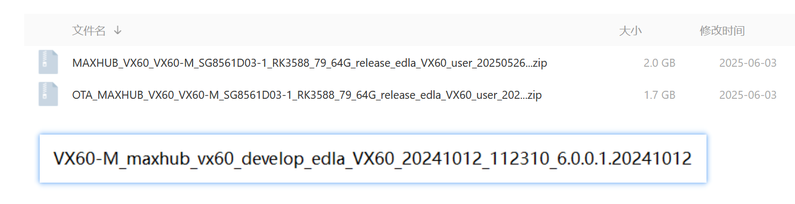
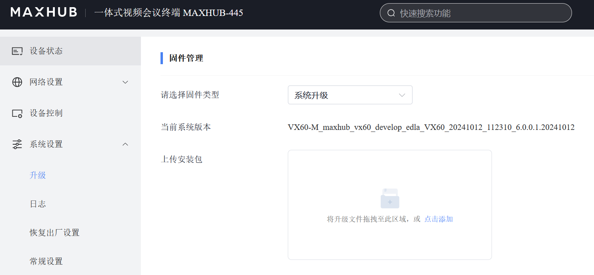

# 固件信息





当前系统固件:
```shell
VX60-M_maxhub_vx60_develop_edla_VX60_20241012_112310_6.0.0.1.20241012
```

与官方提供的固件有所差异


## md5sum

```shell
fcb4065eba689f8ce0533cdca4234cee  MAXHUB_VX60_VX60-M_SG8561D03-1_RK3588_79_64G_release_edla_VX60_user_20250526_225410.zip
3dd71697e1ca85340f778b7696a27b7e  OTA_MAXHUB_VX60_VX60-M_SG8561D03-1_RK3588_79_64G_release_edla_VX60_user_20250526_225410.zip
```

## MAXHUB_VX60_VX60-M_SG8561D03-1_RK3588_79_64G_release_edla_VX60_user_20250526_225410.zip

```shell
# unzip MAXHUB_VX60_VX60-M_SG8561D03-1_RK3588_79_64G_release_edla_VX60_user_20250526_225410.zip 
Archive:  MAXHUB_VX60_VX60-M_SG8561D03-1_RK3588_79_64G_release_edla_VX60_user_20250526_225410.zip
   creating: upgrade_3588/
  inflating: upgrade_3588/version.txt  
  inflating: upgrade_3588/Bitmotion.bin  
  inflating: upgrade_3588/allupgrade_3588_64G_16G.img  
  inflating: upgrade_3588/lt9611uxc.bin  
 extracting: upgrade_3588/allupgrade_3588_64G_16G_MD5.txt  
  inflating: upgrade_3588/vendor_boot-debug.bin  
  inflating: upgrade_3588/software_check_table.txt  
 extracting: upgrade_3588/817_Version.txt  
 extracting: upgrade_3588/CODE_VERSION_INFO.txt  
  inflating: upgrade_3588/817.bin    
  inflating: upgrade_3588/lt6911uxe-B.bin  
  inflating: upgrade_3588/Router---1-0-3-3.bin  
  inflating: upgrade_3588/lt6911uxe-A.bin  
  inflating: upgrade_3588/it6563FN.bin  
# md5sum *
27e22ce6a1bfe42d35cc0bc2838d8ca3  817.bin
a969bccb02c49c76d28bb530fc125e40  817_Version.txt
c77ced84f09d4bfccb9ce41fd50eb618  allupgrade_3588_64G_16G.img
1ef0b34550b4324f1aece8a61e8e8c7d  allupgrade_3588_64G_16G_MD5.txt
fc78c2b20abf8cc6c855efd92b7f7dac  Bitmotion.bin
8ad049bd6d4be2cbd0bfdca312a6cab7  CODE_VERSION_INFO.txt
ec516039d803248459a5b979bf5432c4  it6563FN.bin
d62fb5680620eef455b76deffb71cbec  lt6911uxe-A.bin
e9f37ae44457e1759b3b5f3359256365  lt6911uxe-B.bin
f6f0d772e102642a5727b0827d4e283c  lt9611uxc.bin
643c71235c8f8b08bde5a5887c0e4489  Router---1-0-3-3.bin
e1209bbceecfe8e6ceef17b71aa3fae1  software_check_table.txt
9192b2ac99e3cd7419f0d19c2888cfc3  vendor_boot-debug.bin
ef8d62ee449b718515c4cd4d56d4b1b7  version.txt
# ll
总计 2.7G
drwxr-xr-x 2 root root 4.0K 2025年 5月26日 .
drwxr-xr-x 3 root root 4.0K  6月10日 04:28 ..
-rwxr-xr-x 1 root root  38K 2025年 5月26日 817.bin
-rwxr-xr-x 1 root root    4 2025年 5月26日 817_Version.txt
-rw-r--r-- 1 root root 2.6G 2025年 5月26日 allupgrade_3588_64G_16G.img
-rw-r--r-- 1 root root   62 2025年 5月26日 allupgrade_3588_64G_16G_MD5.txt
-rw-r--r-- 1 root root 912K 2025年 5月26日 Bitmotion.bin
-rw-r--r-- 1 root root   28 2025年 5月26日 CODE_VERSION_INFO.txt
-rwxr-xr-x 1 root root  45K 2025年 5月26日 it6563FN.bin
-rwxr-xr-x 1 root root  26K 2025年 5月26日 lt6911uxe-A.bin
-rwxr-xr-x 1 root root  26K 2025年 5月26日 lt6911uxe-B.bin
-rwxr-xr-x 1 root root  24K 2025年 5月26日 lt9611uxc.bin
-rwxr-xr-x 1 root root  10M 2025年 5月26日 Router---1-0-3-3.bin
-rw-r--r-- 1 root root 1.9K 2025年 5月26日 software_check_table.txt
-rw-r--r-- 1 root root  55M 2025年 5月26日 vendor_boot-debug.bin
-rw-r--r-- 1 root root  12K 2025年 5月26日 version.txt
[root@cloud-ctl4 /data/rockchip/maxhub-vx60/upgrade_3588]# 

```


## OTA_MAXHUB_VX60_VX60-M_SG8561D03-1_RK3588_79_64G_release_edla_VX60_user_20250526_225410.zip


```shell
# unzip OTA_MAXHUB_VX60_VX60-M_SG8561D03-1_RK3588_79_64G_release_edla_VX60_user_20250526_225410.zip 
Archive:  OTA_MAXHUB_VX60_VX60-M_SG8561D03-1_RK3588_79_64G_release_edla_VX60_user_20250526_225410.zip
signed by SignApk
 extracting: META-INF/com/android/metadata  
 extracting: META-INF/com/android/metadata.pb  
 extracting: apex_info.pb            
 extracting: care_map.pb             
 extracting: payload.bin             
 extracting: payload_properties.txt  
  inflating: META-INF/com/android/otacert  
# file *
apex_info.pb:           empty
care_map.pb:            data
META-INF:               directory
payload.bin:            data
payload_properties.txt: ASCII text
# ls -alh
总计 1.7G
drwxr-xr-x 3 root root 4.0K  6月10日 04:35 .
drwxr-xr-x 4 root root 4.0K  6月10日 04:34 ..
-rw-r--r-- 1 root root    0 2009年 1月 1日 apex_info.pb
-rw-r--r-- 1 root root 1023 2009年 1月 1日 care_map.pb
drwxr-xr-x 3 root root 4.0K  6月10日 04:35 META-INF
-rw-r--r-- 1 root root 1.7G 2009年 1月 1日 payload.bin
-rw-r--r-- 1 root root  155 2009年 1月 1日 payload_properties.txt
# md5sum *
d41d8cd98f00b204e9800998ecf8427e  apex_info.pb
897ebaefc8b816c1d16d8b54a75ec802  care_map.pb
md5sum: META-INF: Is a directory
09f364c3d10a30ca8cb18821a72cae24  payload.bin
ccf3573136f8dc00d6fcd8577fee90e2  payload_properties.txt

```


* 拆解payload.bin

```shell
# file *
boot.img:        Android bootimg, kernel
dtbo.img:        data
init_boot.img:   Android bootimg
odm_dlkm.img:    data
odm.img:         data
product.img:     data
resource.img:    data
system_dlkm.img: data
system_ext.img:  data
system.img:      data
uboot.img:       Device Tree Blob version 17, size=3072, boot CPU=0, string block size=208, DT structure block size=2460
vbmeta.img:      data
vendor_boot.img: data
vendor_dlkm.img: data
vendor.img:      data
# ls -alh *
-rw-r--r-- 1 root root  64M  6月 10 12:37 boot.img
-rw-r--r-- 1 root root 4.0M  6月 10 12:37 dtbo.img
-rw-r--r-- 1 root root 8.0M  6月 10 12:38 init_boot.img
-rw-r--r-- 1 root root 340K  6月 10 12:38 odm_dlkm.img
-rw-r--r-- 1 root root 364K  6月 10 12:38 odm.img
-rw-r--r-- 1 root root 123M  6月 10 12:38 product.img
-rw-r--r-- 1 root root  13M  6月 10 12:38 resource.img
-rw-r--r-- 1 root root 340K  6月 10 12:38 system_dlkm.img
-rw-r--r-- 1 root root 535M  6月 10 12:39 system_ext.img
-rw-r--r-- 1 root root 948M  6月 10 12:38 system.img
-rw-r--r-- 1 root root  20M  6月 10 12:39 uboot.img
-rw-r--r-- 1 root root  12K  6月 10 12:39 vbmeta.img
-rw-r--r-- 1 root root  60M  6月 10 12:39 vendor_boot.img
-rw-r--r-- 1 root root 185M  6月 10 12:39 vendor_dlkm.img
-rw-r--r-- 1 root root 594M  6月 10 12:39 vendor.img

```


---