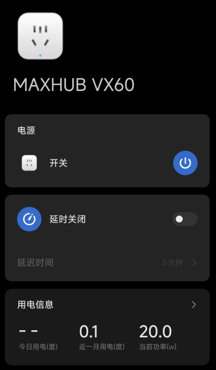

# 基本信息

- 安卓版本：

```shell
+ getprop ro.build.version.release
13
+ getprop ro.build.version.sdk
33
+ getprop ro.build.display.id
rk3588_t-userdebug 13 TD1A.220804.031 230701 release-keys
+ getprop ro.product.model
VX60
+ getprop ro.product.manufacturer
CVTE
+ getprop ro.product.name
VX60
+ getprop ro.board.platform
rk3588
+ getprop ro.hardware
rk30board
+ getprop ro.build.fingerprint
MAXHUB/VX60/rk3588_t:13/TD1A.220804.031/230701:userdebug/release-keys
```

- 内核版本：

```shell
rk3588_t:/ $ uname -a
Linux localhost 5.10.209-maybe-dirty #1 SMP PREEMPT Thu Jan 1 00:00:00 UTC 1970 aarch64 Toybox
rk3588_t:/ $ cat /proc/version
Linux version 5.10.209-maybe-dirty (build-user@build-host) (Android (8508608, based on r450784e) clang version 14.0.7 (https://android.googlesource.com/toolchain/llvm-project 4c603efb0cca074e9238af8b4106c30add4418f6), LLD 14.0.7) #1 SMP PRE
EMPT Thu Jan 1 00:00:00 UTC 1970
```


- cpu:

```shell
rk3588_t:/ $ cat /proc/cpuinfo
processor       : 0
BogoMIPS        : 48.00
Features        : fp asimd evtstrm aes pmull sha1 sha2 crc32 atomics fphp asimdhp cpuid asimdrdm lrcpc dcpop asimddp
CPU implementer : 0x41
CPU architecture: 8
CPU variant     : 0x2
CPU part        : 0xd05
CPU revision    : 0

processor       : 1
BogoMIPS        : 48.00
Features        : fp asimd evtstrm aes pmull sha1 sha2 crc32 atomics fphp asimdhp cpuid asimdrdm lrcpc dcpop asimddp
CPU implementer : 0x41
CPU architecture: 8
CPU variant     : 0x2
CPU part        : 0xd05
CPU revision    : 0

processor       : 2
BogoMIPS        : 48.00
Features        : fp asimd evtstrm aes pmull sha1 sha2 crc32 atomics fphp asimdhp cpuid asimdrdm lrcpc dcpop asimddp
CPU implementer : 0x41
CPU architecture: 8
CPU variant     : 0x2
CPU part        : 0xd05
CPU revision    : 0

processor       : 3
BogoMIPS        : 48.00
Features        : fp asimd evtstrm aes pmull sha1 sha2 crc32 atomics fphp asimdhp cpuid asimdrdm lrcpc dcpop asimddp
CPU implementer : 0x41
CPU architecture: 8
CPU variant     : 0x2
CPU part        : 0xd05
CPU revision    : 0

processor       : 4
BogoMIPS        : 48.00
Features        : fp asimd evtstrm aes pmull sha1 sha2 crc32 atomics fphp asimdhp cpuid asimdrdm lrcpc dcpop asimddp
CPU implementer : 0x41
CPU architecture: 8
CPU variant     : 0x4
CPU part        : 0xd0b
CPU revision    : 0

processor       : 5
BogoMIPS        : 48.00
Features        : fp asimd evtstrm aes pmull sha1 sha2 crc32 atomics fphp asimdhp cpuid asimdrdm lrcpc dcpop asimddp
CPU implementer : 0x41
CPU architecture: 8
CPU variant     : 0x4
CPU part        : 0xd0b
CPU revision    : 0

processor       : 6
BogoMIPS        : 48.00
Features        : fp asimd evtstrm aes pmull sha1 sha2 crc32 atomics fphp asimdhp cpuid asimdrdm lrcpc dcpop asimddp
CPU implementer : 0x41
CPU architecture: 8
CPU variant     : 0x4
CPU part        : 0xd0b
CPU revision    : 0

processor       : 7
BogoMIPS        : 48.00
Features        : fp asimd evtstrm aes pmull sha1 sha2 crc32 atomics fphp asimdhp cpuid asimdrdm lrcpc dcpop asimddp
CPU implementer : 0x41
CPU architecture: 8
CPU variant     : 0x4
CPU part        : 0xd0b
CPU revision    : 0
```

- 内存：

```shell
1|rk3588_t:/ $ free -h
                total        used        free      shared     buffers
Mem:              15G        4.5G         11G         40M         31M
-/+ buffers/cache:           4.5G         11G
Swap:            3.8G           0        3.8G
rk3588_t:/ $ free
                total        used        free      shared     buffers
Mem:      16592732160  4922535936 11670196224    41865216    32993280
-/+ buffers/cache:     4889542656 11703189504
Swap:      4148178944           0  4148178944
rk3588_t:/ $ free -h
                total        used        free      shared     buffers
Mem:              15G        4.5G         11G         40M         31M
-/+ buffers/cache:           4.5G         11G
Swap:            3.8G           0        3.8G
rk3588_t:/ $ cat /proc/meminfo
MemTotal:       16203840 kB
MemFree:        11394896 kB
MemAvailable:   12422780 kB
Buffers:           32236 kB
Cached:          1791600 kB
SwapCached:            0 kB
Active:           198076 kB
Inactive:        2555316 kB
Active(anon):       2168 kB
Inactive(anon):  1094752 kB
Active(file):     195908 kB
Inactive(file):  1460564 kB
Unevictable:      159808 kB
Mlocked:          127532 kB
SwapTotal:       4050956 kB
SwapFree:        4050956 kB
Dirty:                76 kB
Writeback:             0 kB
AnonPages:       1089364 kB
Mapped:          1028580 kB
Shmem:             40884 kB
KReclaimable:     226928 kB
Slab:             322336 kB
SReclaimable:     126380 kB
SUnreclaim:       195956 kB
KernelStack:       36848 kB
ShadowCallStack:    9248 kB
PageTables:        69672 kB
NFS_Unstable:          0 kB
Bounce:                0 kB
WritebackTmp:          0 kB
CommitLimit:    12152876 kB
Committed_AS:   103032344 kB
VmallocTotal:   263061440 kB
VmallocUsed:      104752 kB
VmallocChunk:          0 kB
Percpu:             8256 kB
AnonHugePages:         0 kB
ShmemHugePages:        0 kB
ShmemPmdMapped:        0 kB
FileHugePages:     10240 kB
FilePmdMapped:     10240 kB
CmaTotal:         262144 kB
CmaFree:          252608 kB
```


- 分区情况：

```shell
rk3588_t:/ $ ls /dev/block/mmc* -alh
ls: /dev/block/mmcblk0p11: Permission denied
ls: /dev/block/mmcblk0p21: Permission denied
brw------- 1 root   root   179,   0 2026-06-10 10:41 /dev/block/mmcblk0
brw------- 1 root   root   179,   8 1970-01-01 08:00 /dev/block/mmcblk0boot0
brw------- 1 root   root   179,  16 1970-01-01 08:00 /dev/block/mmcblk0boot1
brw------- 1 root   root   179,   1 1970-01-01 08:00 /dev/block/mmcblk0p1
brw------- 1 root   root   259,   2 1970-01-01 08:00 /dev/block/mmcblk0p10
brw------- 1 root   root   259,   4 1970-01-01 08:00 /dev/block/mmcblk0p12
brw------- 1 root   root   259,   5 1970-01-01 08:00 /dev/block/mmcblk0p13
brw------- 1 root   root   259,   6 1970-01-01 08:00 /dev/block/mmcblk0p14
brw------- 1 root   root   259,   7 1970-01-01 08:00 /dev/block/mmcblk0p15
brw------- 1 root   root   259,   8 1970-01-01 08:00 /dev/block/mmcblk0p16
brw------- 1 root   root   259,   9 1970-01-01 08:00 /dev/block/mmcblk0p17
brw------- 1 root   root   259,  10 1970-01-01 08:00 /dev/block/mmcblk0p18
brw------- 1 root   root   259,  11 1970-01-01 08:00 /dev/block/mmcblk0p19
brw------- 1 root   root   179,   2 1970-01-01 08:00 /dev/block/mmcblk0p2
brw------- 1 root   root   259,  12 1970-01-01 08:00 /dev/block/mmcblk0p20
brw-rw---- 1 system system 259,  14 1970-01-01 08:00 /dev/block/mmcblk0p22
brw-rw---- 1 system system 259,  15 2026-06-10 10:01 /dev/block/mmcblk0p23
brw------- 1 root   root   259,  16 1970-01-01 08:00 /dev/block/mmcblk0p24
brw-rw---- 1 system system 259,  17 1970-01-01 08:00 /dev/block/mmcblk0p25
brw------- 1 root   root   259,  18 1970-01-01 08:00 /dev/block/mmcblk0p26
brw------- 1 root   root   259,  19 1970-01-01 08:00 /dev/block/mmcblk0p27
brw------- 1 root   root   259,  20 1970-01-01 08:00 /dev/block/mmcblk0p28
brw------- 1 root   root   259,  21 1970-01-01 08:00 /dev/block/mmcblk0p29
brw------- 1 root   root   179,   3 1970-01-01 08:00 /dev/block/mmcblk0p3
brw------- 1 root   root   179,   4 1970-01-01 08:00 /dev/block/mmcblk0p4
brw------- 1 root   root   179,   5 1970-01-01 08:00 /dev/block/mmcblk0p5
brw------- 1 root   root   179,   6 1970-01-01 08:00 /dev/block/mmcblk0p6
brw------- 1 root   root   179,   7 1970-01-01 08:00 /dev/block/mmcblk0p7
brw------- 1 root   root   259,   0 1970-01-01 08:00 /dev/block/mmcblk0p8
brw------- 1 root   root   259,   1 1970-01-01 08:00 /dev/block/mmcblk0p9
```


- 功耗：




