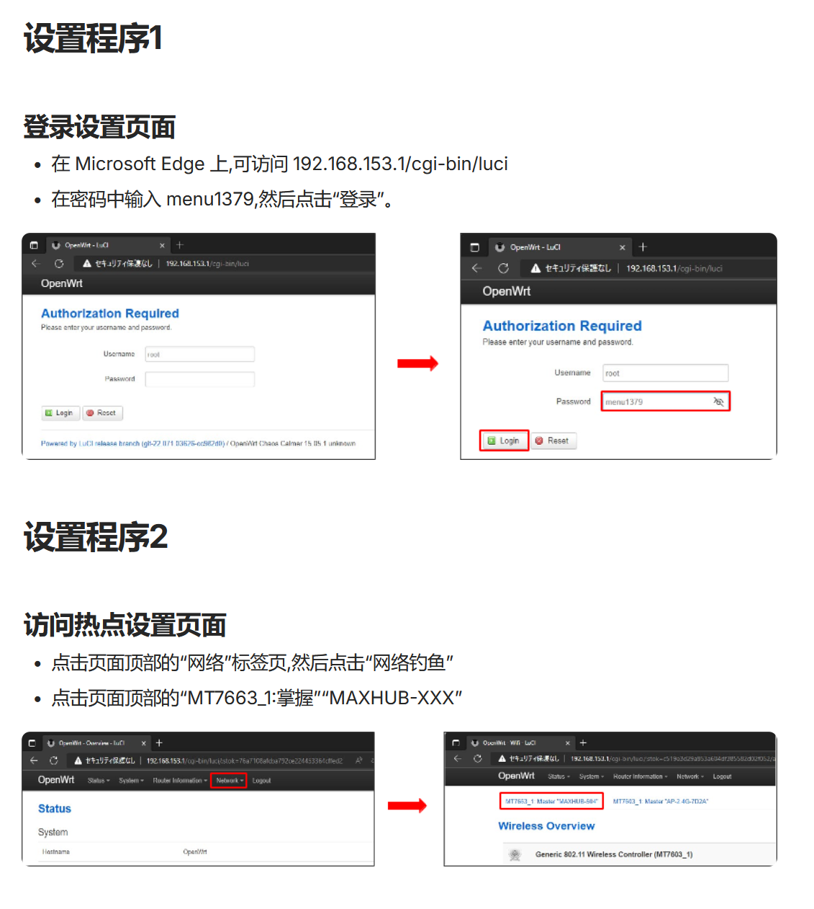
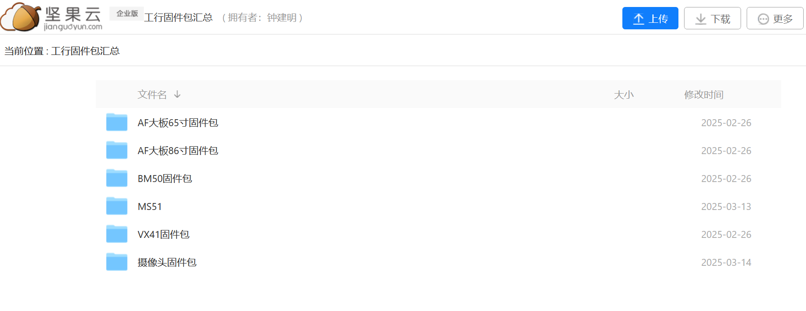
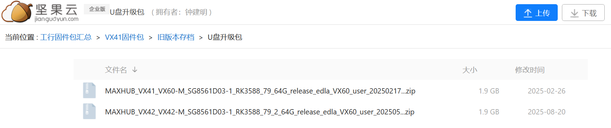
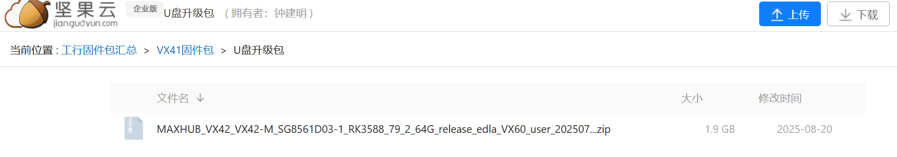
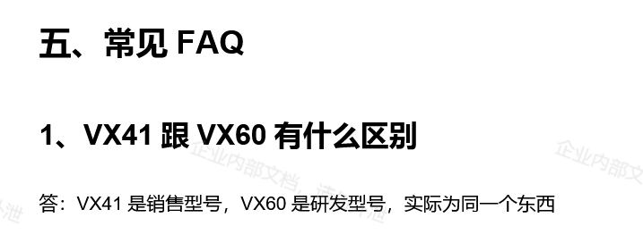
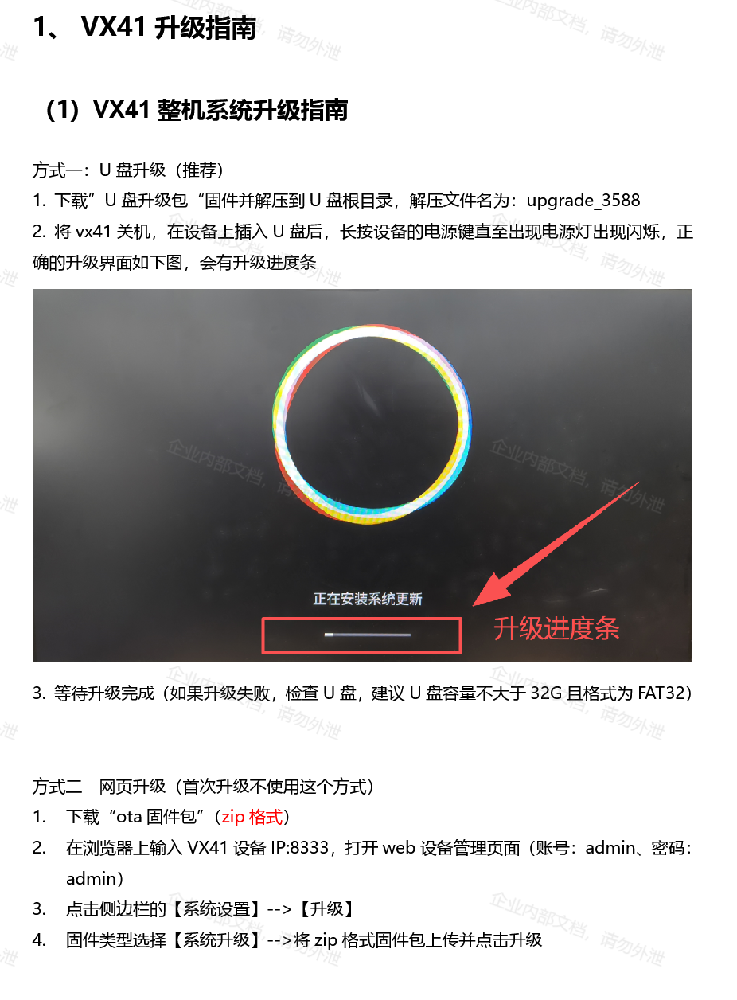
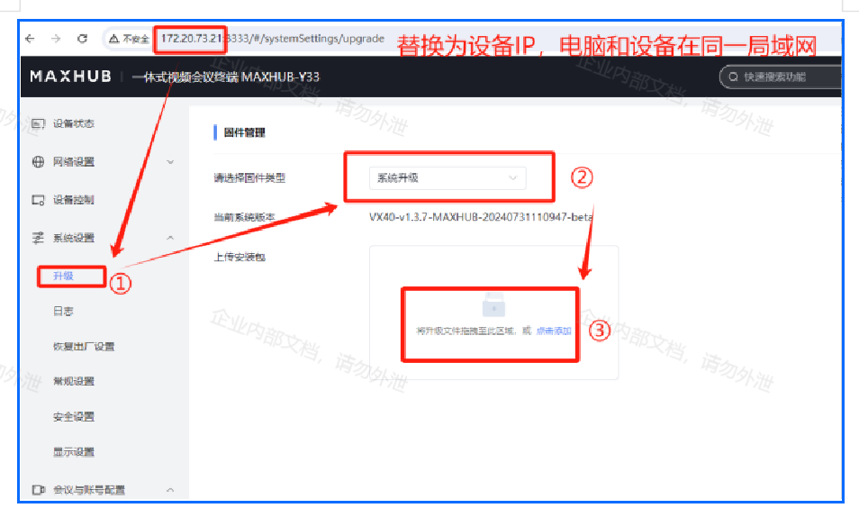

# 官方答疑

## openwrt密码

<https://docs.channel.io/nicemobile-v6cf/ja/articles/%E6%96%BD%E6%89%8B%E9%A0%86-798b5f63#%E8%A8%AD%E5%AE%9A%E6%89%8B%E9%A0%861>


默认情况下，需要在android系统中登陆页面<http://192.168.153.1/>

账号密码： root/menu1379




## 工行固件

联系官方客服获取资料

- vx60工行调试升级文档、固件及操作指南（包含AFXXMC、VX41、MS51）：<https://cvte.kdocs.cn/l/cgOFrffWyLnY>
- VX60固件：<https://drive.cvte.com/p/DWod18YQqZcCGPWINiAA>
- 工行固件打包：<https://drive.cvte.com/p/DYaCLWYQsD8Y6_sOIAA>








说在前，工行固件也是android13，开启了很多限制，建议为了方便玩耍还是用原厂自带的工程固件就好了。

## 工行固件刷机

* 系统支持ota升级，也可以用rkdevtool更新升级








TIPS:

```text
风险提示：亲，这边提供的方法有一定概率可以恢复正常，如尝试后无法解决问题，或有其他问题出现，仍属于保外范围，若需要上门，工程师会收取一定费用，请知悉哦。
```


---